# Serverless Workshop Challenge 1 - Storage

Storage is the backbone of everything we do at Azure.  For this first part of the walkthrough, you will create two storage accounts.

The first storage account will be used for the landing zone for uploaded images.  You will be able to leverage a program to push data into storage or you can manually upload images.

The second storage account will be a datalake storage for all of the export data. Even though this won't be used until later, it is easiest to just create it now.

Since this is training and it's fun, this guide will do the original storage with the Azure CLI and then the second storage in the portal. This is a great approach because it gives you a chance to do things that don't just involve point and click.  If you'd like to challenge yourself on a second run-through, consider building ARM or Bicep templates to provision the two storage accounts.

## Access the cloud shell for your subscription

There are two ways to interact with Azure using the Azure CLI.  You can run from your local machine in any Terminal (Bash, Windows, Mac, Linux, etc) or PowerShell, or you can use the cloud shell.

Since the cloud shell already has the Azure CLI tools installed, just use the cloud shell for this first part.

This task builds the highlighted portion as shown:

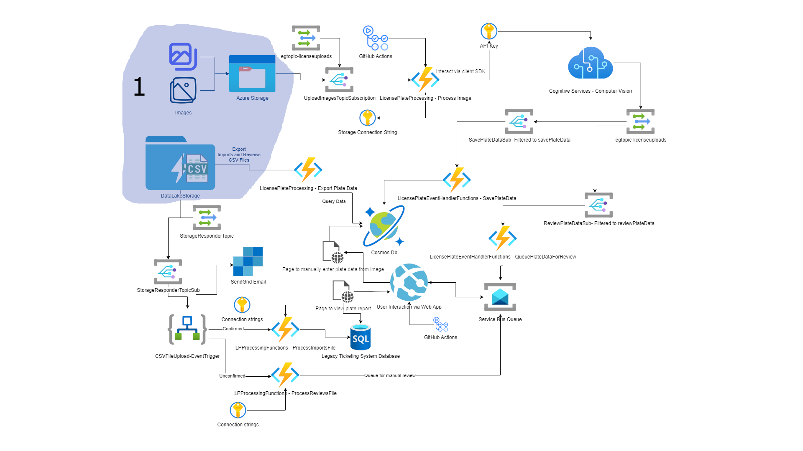  

## Task 1 - Create a resource group

For this solution, everything you do will be in the same resource group.  This is a good idea as you will want to be able to clean this up when you are done.  A resource group is a great boundary for RBAC and policy (governance) and is an excellent way to group resources that have a similar lifecycle.

1. Open the cloud shell.

    To open the Azure cloud shell, you can either use the little terminal icon in the center of the Azure portal, or you can just navigate to [`https://shell.azure.com`](https://shell.azure.com).

    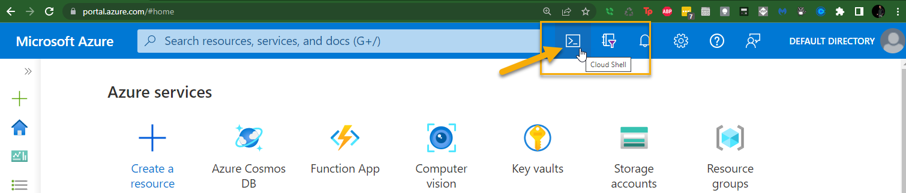

    or

    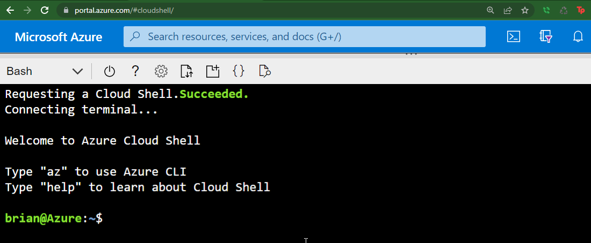

    Make sure to choose `Bash` as the shell for executing commands.

    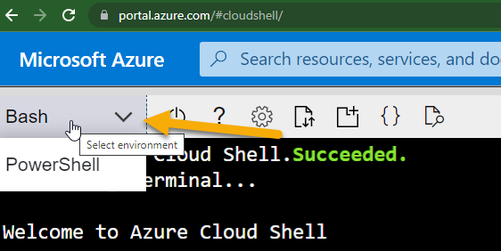

1. Ensure you are in the correct subscription.

    >**Note**: If you only have one subscription, you should just skip to the next step.

    Assuming you have multiple subscriptions, type the following command to ascertain your current context:  

    ```bash
    az account show
    ```  

    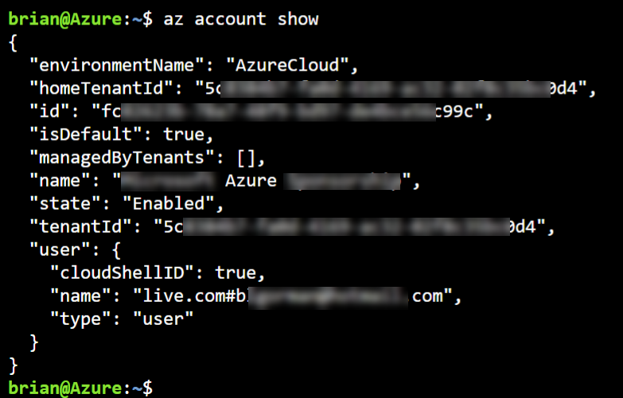  

    If you are **not** in the correct subscription, get all of your subscriptions with the following command:

    ```bash
    az account list --query "[].{Id:id,Name:name}" -o table
    ```  

    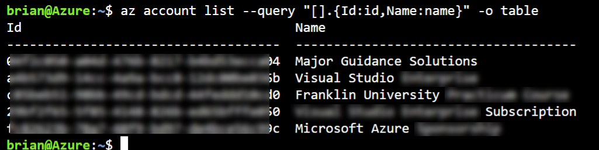

    This will give you a list.  Find the one you want from this list.  
    
    You can then pick either the Id or the Name and set your context with the following command:  

    ```bash
    az account set --subscription <id-or-name-here>
    ```  

    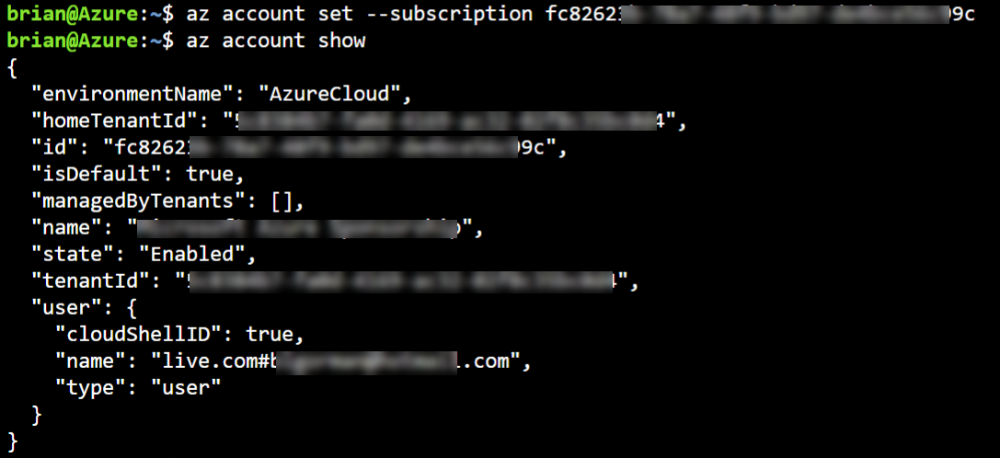  

1. Add variables for resource group and location.  

    Determine the name for your resource group.  A suggestion might be:  

    ```bash
    rg=RG-ServerlessWorkshopYYYYMMDD
    ```
    
    Where `YYYYMMDD` is replaced by the date.

    The second thing you need is 
    Use the following command to set a name and location of your choice.

    Run the following command to see all possible locations:

    ```bash
    az account list-locations --query "[].{DisplayName:displayName,Name:name}" -o table
    ```  

    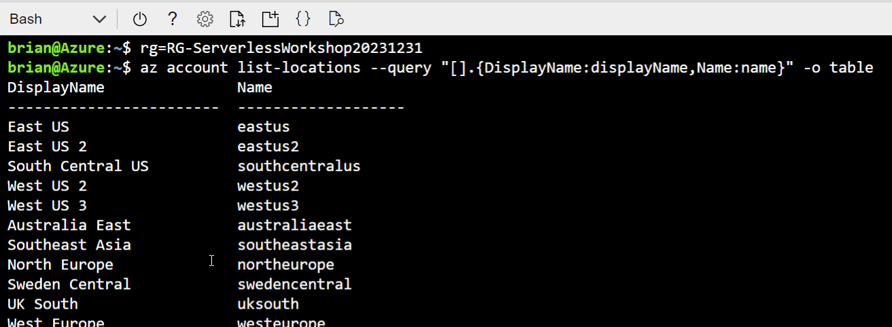

    You will want to choose wisely here as you will want to put most (if not all) of your resources in the same location.  For that reason, try to choose one of the primary regions - [see this document for more info](https://azure.microsoft.com/en-us/global-infrastructure/geographies/?WT.mc_id=AZ-MVP-5004334)  

    Once you've determined your region, run the following command (replace <your-region-choice> with the name of your preferred region, something like eastus, australiaeast, or uksouth):

    ```bash
    loc=<your-region-choice>
    ```  

1. Execute the command to create a resource group  

    With the commands in place for the `rg` and `loc` variables, you can now easily create your resource group:  

    ```bash
    az group create -g $rg -l $loc
    ```  

    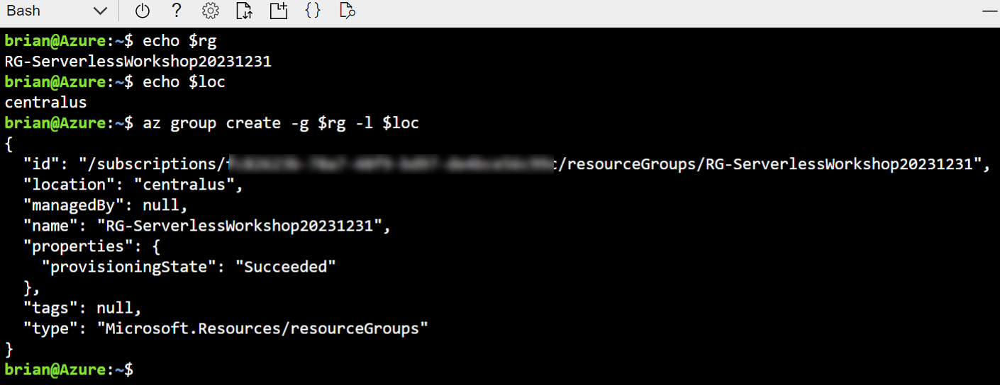

## Task 2 - Create the images storage account and container

The first storage account you will need can be a simple storage account that just houses images in a container.

Feel free to create this account any way you see fit.  This walkthrough will create the account in the Azure cloud shell in the same way that the resource group was just created.

### Create the account  

To have a container, you first need an account.  This first part will walk you through creating an account with the Azure CLI.

1. Validate variables

    To start, ensure your variables are set as expected:

    ```bash
    echo $rg
    echo $loc
    ```  

    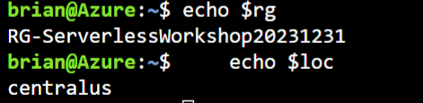

    If these aren't set, then use the steps in the task above to set them as expected.

1. Validate the group exists.

    Next, ensure the resource group exists:

    ```bash
    az group exists -g $rg
    ```  

    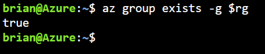

    If the group doesn't exist, create it.

1. Create the variables for the storage account.  

    At a minimum, you need the name of the account, the resource group, the location, and the SKU for the storage.

    We're going to add options for locking down blobs and allowing key access.

    For our storage during this training, we don't need any redundancy.  However we would likely want a different tier if we have resilience requirements in a production solution.

    For the name, update `xyz` to your initials for a unique account name.  Remember that storage account names are 3-24 characters, all lowercase or 0-9 only, no special characters or dashes.

    ```bash
    storageAcctName="plateimages20231231xyz"
    sku="Standard_LRS"
    
    az storage account create --name $storageAcctName --resource-group $rg --location $loc --allow-blob-public-access false --allow-shared-key-access true
    ```  

    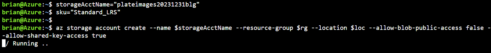

1. Validate the account was created

    Run the following command to ensure the account was created:

    ```bash
    az storage account show --resource-group $rg --name $storageAcctName --query name -o tsv
    ```  

    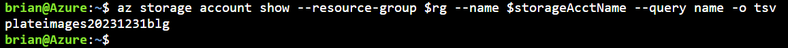  

### Create the Container

Now that you have an account, you need to add the container for images.  As with previous steps, any missing variables would need to be established as above before continuing with this step.  If you've stepped away, you may have to refresh them.  

1. Set the images container name.

    Set the variable as follows:

    ```bash
    containerName=images
    ```  

1. Create the container

    Since the current account has no public access, there is no need to specify the access on the container creation.  

    Use the following command to create the images container:

    ```bash
    az storage container create --name $containerName --account-name $storageAcctName
    ```  

    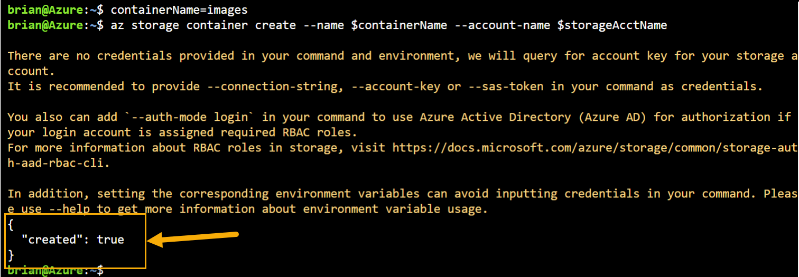  

1. Validate container exists

    Run the following command to validate the container exists:

    ```bash
    az storage container exists --name $containerName --account-name $storageAcctName
    ```  

### Get the storage account connection string

You will need the storage account and connection string to upload images to the storage account for running the end-to-end testing of the solution.  

You will use C#.Net with the Azure Storage SDK to easily upload images to the `images` container.

1. Get the account connection string.

    Run the following command to get the connection string: 

    ```bash
    az storage account show-connection-string --name $storageAcctName -o tsv
    ```  

    Copy the output and save it somewhere so you will have it for the future.  Note that the connection string contains the endpoint and the primary key in case you would have need to separate those values at a later time.

## Task 3 - Create the exports storage account.

As stated earlier, the exports storage account isn't going to be needed for some time, however this is the best time to create it for learning purposes.  

### Create the storage account using the portal

You've just used the Azure CLI and you could easily do this again (ensure you make it a DataLake storage account, however).

Instead, for this task, you'll create the storage account in the portal.

1. Browse to storage accounts in the portal.  

    Navigate to the portal [https://portal.azure.com](https://portal.azure.com)  and then type:

    ```text
    storage accounts
    ```  

    in the top middle search bar.  

      

    Hit `Enter` to navigate and see all existing storage accounts.

1. Start the creation of a new storage account.

    Select `+ Create` on the top left of the storage account blade:  

      

    When the `Create a storage account` blade is shown, select your appropriate subscription and resource group.

    Name the storage account something similar to

    ```text
    datalakexprts20231231xyz
    ```  
    
    Make sure to replace `xyz` with your initials.  

    Leave the `Performance` to `Standard` and set the `Redundancy` to `Locally-redundant storage (LRS)`  

    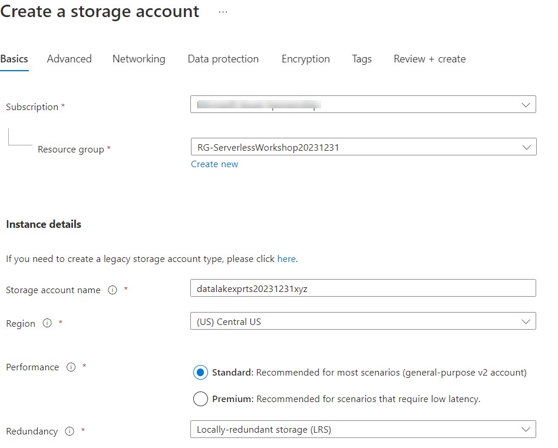

    Hit the `Next: Advanced >` button. 

1.  Ensure Data Lake on Advanced Tab

    For this `Advanced` tab, leave everything as-is, but also make sure to check the box for `Enable hierarchical namespace` to make this a Data Lake Storage Gen 2.

    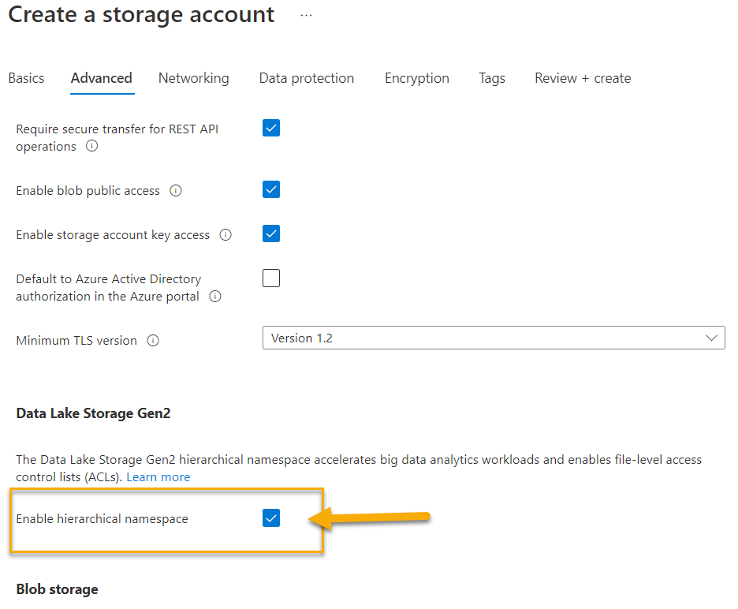  

    Hit the `Review + create` button

1. Validate and Create the account

    Wait for validation to complete, then create the account.  

    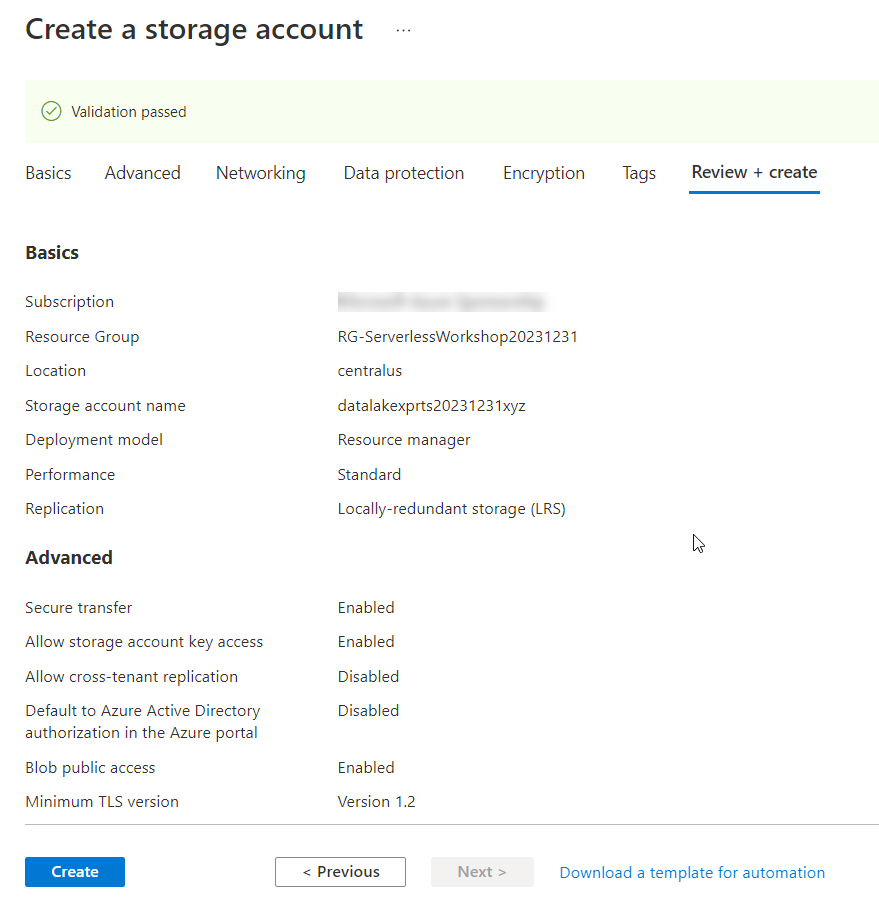  

### Create exports container

To complete the storage walkthrough, you'll create a container for exports.

1. Add the container.  

    Navigate to the new account and select the `Containers` blade from the left-navigation.   

    Hit the `+ Container` button and then type 

    ```text
    exports
    ```  

    in the `Name` section on the right-hand side.

    Leave the `Public access level` set to `Private (no anonymous access)`.  

    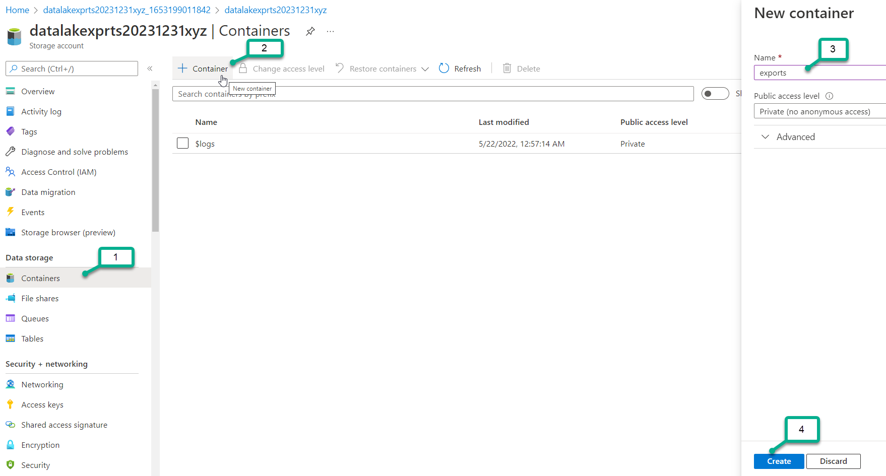

    >**Note**: if you don't see the right-hand side menu, zoom out so that you get more shown on your screen

1. Get the storage connection string for this account.

    In the portal, on the left-hand nav, select `Access keys.`  
    
    In the access keys blade, click on the eyeball icon with text `show keys` to see your keys.

    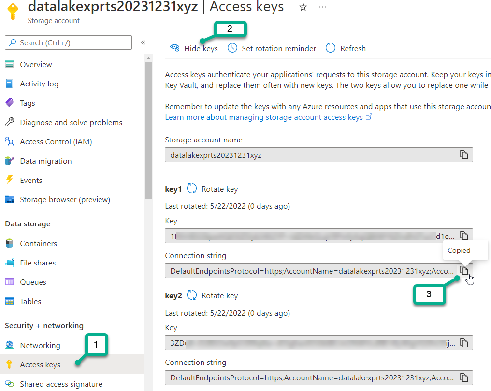

    Copy and paste your Connection String to the same place you have your connection string for the first storage account.  

## Completed

You have now completed the first walkthrough for this serverless workshop.

When you are ready, please proceed to the next step -> Image Processing and Storage Events.
