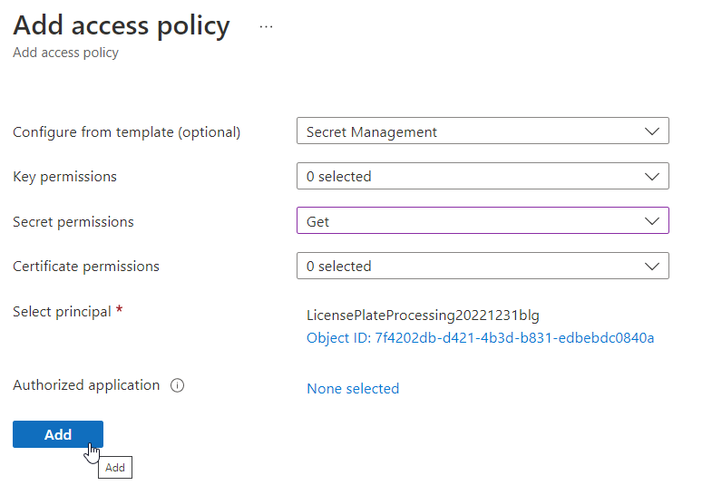

# Serverless Workshop Challenge 2 - Image Processing and Storage

In this second challenge, you will create the Azure Function app and event responses to handle image processing.

When an image is uploaded to storage, the event grid subscription will trigger your Azure Function App with a Function called "ProcessImage".

>**Note:** For simplicity, a solution app that contains all of the code can be found in the repository under the folder `Solutions`.  

## Task 1 - Create the Azure Function App

To get started, the first thing you will need to do is create a new Azure Function App.  You can do this in either Visual Studio or Visual Studio Code.  

This walkthrough will utilize Visual Studio, with a similar approach to [this documentation on docs.microsoft.com](https://docs.microsoft.com/en-us/azure/azure-functions/functions-create-your-first-function-visual-studio?WT.mc_id=AZ-MVP-5004334).

If you would prefer to use VSCode, [check out this documentation](https://docs.microsoft.com/en-us/azure/azure-functions/create-first-function-vs-code-csharp?WT.mc_id=AZ-MVP-5004334&tabs=in-process)  

1. Create a new Azure Function Project in Visual Studio.

    Open Visual studio and create a new project in a folder location that makes sense, using filters to select the `Function App` type.  

      

    Name the new project something like:

    ```text
    LicensePlateProcessingFunctions
    ```  

    This project will ultimately have a function that starts and manages the image processing and integration with computer vision, and a function to export data into Cosmos after processing is completed in Azure Computer Vision

      

    >**Note:** In the walkthrough and for easy testing, you could also start by creating an Http trigger and just deploy with that for testing. You would then just add a new function with an Event Grid trigger.

    You might have already guessed that a `trigger` on an azure function is how the function is started.  Make a note of the options, but especially notice that options such as `http trigger` for direct post, timer trigger for automatic runs on cron intervals, queue trigger, blob trigger, and others give you plenty of options to start your function as needed. [Learn more about triggers and bindings here](https://docs.microsoft.com/en-us/azure/azure-functions/functions-triggers-bindings?WT.mc_id=AZ-MVP-5004334&tabs=csharp)  

    For the function, select `Event Grid Trigger`. 

      

1. Rename the function to `ProcessImage`  

    When the function is created, right click on the `Function1.cs1 file in the solution explorer and rename it as:

    ```text
    ProcessImage.cs
    ```  

    Make sure to select "Yes" to rename and also manually update the code above the Run method: `[FunctionName("Function1")]` to the new value:  

    ```text
    [FunctionName("ProcessImage")]
    ```  

1. Add a Blob storage input binding

    Azure functions can have bindings for input or output.  To make a long story short, bindings allow you to interact with other Azure solutions without having to write plumbing code.

    For example, later in the workshop you will create another function that will also integrate with storage.  In that one, you will not use an input binding.  Instead, you will use the SDK and the storage account connection string to compose the connection and get the specified blob.

    For this event-triggered function, however, you will create the input binding to rely on blob storage.  This will make it extremely easy to work with the blob with minimal code.

    [Learn more about Azure Function triggers and bindings](https://docs.microsoft.com/en-us/azure/azure-functions/functions-triggers-bindings?WT.mc_id=AZ-MVP-5004334&tabs=csharp)  

    Change the signature of the method to include the blob input binding as follows:

    ```c#
    [FunctionName("ProcessImage")]
    public static void Run([EventGridTrigger]EventGridEvent eventGridEvent
        , [Blob(blobPath: "{data.url}", access: FileAccess.Read,
            Connection = "plateImagesStorageConnection")] Stream incomingPlateImageBlob
        , ILogger log)
    {
        log.LogInformation(eventGridEvent.Data.ToString());
    }
    ```  

    Note that this change will also require you bring in the Microsoft.Azure.WebJobs.Extensions.Storage Nuget Package.

     

    Also note the name of the connection.  

    The connection named here will be a key-value pair in the application configuration in order to connect to Azure storage.  You will do this in the deployed Function App's configuration in a later task in this challenge.   

      

    There is more to do in this function, but that will come in the next challenge.

    Next, you will deploy this function app as it currently stands to ensure that everything is set correctly.

## Task 2 - Create a repository, push the code to the repository. 

Although it is probably trivial to most of you, this guide will give a full walkthrough to create a new git repository locally and at GitHub.

Additionally, you might choose to use Visual Studio for GIT interaction.  For this walkthrough, we'll start with commands in the command line and only use visual studio to push new changes after the initial setup.

1. Create a new visual studio `.gitignore` file

    Open an terminal of choice (i.e. Git Bash), and navigate to the folder that contains your Azure Function App solution.

    Once you are in the correct folder, use the dotnet tools to create a new `.gitignore` file:

    ```bash
    dotnet new gitignore
    ```  

    >**Note:** This command requires that you have a current .Net SDK installed. To get the latest dotnet tools, [download the sdk here](https://dotnet.microsoft.com/en-us/download/dotnet/6.0)  

    .

1. Initialize the repository

    With the `.gitignore` file in place, you can create the new repository.  

    To create the local repository, run the command

    ```bash
    git init
    ```  

    

1. Add and commit all the files

    Yes, you generally should be careful when using `git add .` to avoid accidentally adding files you are not ready to commit.  However, this is an initial commit so it's easiest to just bulk add.

    Run the commands to stage all of the files for commit, then commit them with a message like `initial commit`:

    ```bash
    git add .
    git commit -m "initial commit"
    ```  

1. Create a new repository in your GitHub account to house the code.

    With the local repository ready to go, it's time to set up the remote repository.

    Navigate to `https://www.github.com` and create a new repository in your account.

    Name the repository something like:

    ```text
    LicensePlateProcessingFunctions
    ```  

    Make the repository private.  

      

    Do not initialize anything in the repository since you already have local code you will be pushing soon.

    Feel free to enable any third-party security tools you have on your repositories, but rememeber those will likely create workflows (not a big deal, just additional actions running).   

      

    Select `Create Repository`

    You will be taken to the setup page with all of the commands you need for the next step.  

1. Push your local code to GitHub  

    Get the code from `...or push an existing repository from the command line` by hitting the `copy-to-clipboad` icon in the setup page for the existing repo code.

      

    Paste the code into your active terminal and run it to push to the main at GitHub.  

      

1. Ensure repository is in place at GitHub.

    On the GitHub page, refresh to see the code is now in your repository as expected.  

      

## Task 3 - Create an Azure function App and utilize Azure to build a pipeline for deployment

In this task, you will create an Azure Function App to host the function app created in the previous task.  

1. Navigate to the Azure Portal.

    Open your browser and navigate to the azure portal.

    To be certain, you could create the function app with the Azure CLI, but we'll save that for another day (you should try it, and then try it again with ARM templates and Bicep!).  

    In the portal search, type `Function` and then select `Function App`.  

      
 
    On the Function App blade, select `+ Create` to begin the process of creating a new function.  

      

1. Create the Function app (Basics)

    Ensure that you have selected the correct subscription and resource group.  

    Name the function app something like:  

    ```text
    LicensePlateProcessingYYYYMMDDxyz
    ```  
    
    Replacing the `YYYYMMDD` with the date and `xyz` with your initials.

    Utilize the `Code` deployment for `.Net 6`, and select the region of preference for your solutions.    

      

    Scroll down and ensure that the operating system is `Windows` and the Plan is `Consumption (Serverless)`.  

    Hit `Next: Hosting`.

1. Create the Function app (hosting)  

    For the hosting, you need a backing storage account.  It is fine to use the images or the datalake storage account if you would like to use one or the other.  For simplicity, however, you can just create a new backing storage account for the app as generated.

    >**TL/DR:** Optionally, change to an existing storage account. Otherwise, just accept the generated version

      

    Hit the `Next: Networking >` button.  

1. Create the Function app (Networking)  

    Review the options for Networking.  Note that there is nothing you can change in this implementation.  If you were hosting elsewhere, you could create this in a private network.  [Learn More here](https://go.microsoft.com/fwlink/?linkid=2157533)  

    Hit the `Next: Monitoring >` button.

1. Create the function app (Monitoring)

    You will always want to utilize Application Insights unless you have a very good reason not to.  

    You can create a new instance of Application Insights or use an existing one.

    If you were really wanting good monitoring, I would recommend pre-building an application insights instance that is backed by a Log Analytics workspace. You could just select it here if you had pre-created it. 

    For this workshop, using the default new instance is all you need.  

      

    Hit the `Review + create` button.

1. Finish Creation of the Function app

    Once the validation is completed, hit the `Create` button.  Wait for the deployment to complete, and validate your function app is running at Azure as expected.  

      

    Click on the url to see that the function app is running.  

      

## Task 4 - Add the pipeline

In this task, you will wire up the pipeline to publish your function app from GitHub to Azure.

If for some reason you cannot do this automatically, you can [follow these steps](https://docs.microsoft.com/azure/azure-functions/functions-how-to-github-actions?WT.mc_id=AZ-MVP-5004334) to do it manually. 

If you do have to do this manually, please review the YAML shown in the next task to expedite your work.

1. Navigate to the Function App in the portal

    On the function app blade, select `Deployment Center`. 

    On the `Deployment Center` blade, use the settings tab to configure your GitHub repository (you may need to authorize to connect it if this is the first time you've done this)  

      

    Make sure to complete the configuration and if you would like you can preview the file that will be generated.  
    
    >**Note**: The yaml file will be placed in your repo on the main branch, so you'll need to fetch & pull before making future changes locally.

    Wait for the action to complete.  It is highly likely the first run will fail, either because you forgot to save some changes and push them or the default build is faulty. If you succeed out of the gates, congratulations!  

    If you fail, review the logs and correct any errors that are your fault (such as not having resources because you forgot to save changes after importing the NuGet packages for Blob Events).

      

    After fixing my error, the default build did deploy as expected.  
    
    
    
    Note that it took 2 minutes and 26 seconds.

    Drill into the log to see what the holdup was:

      

    The steps that are longer running are the steps for restoring dependencies and running the Azure functions action.  The rest of the executions are negligible, however, the Setup of the environment also took 25 seconds.

    We can improve this.  However, before we do that, let's ensure the thing deployed.

1. Validate the function is in the portal

    Navigate back to the function app and review the function app in the portal.

      

    Once you've validated the function is there, proceed to the next step.

## Task 5 - Update the pipeline build agent

The windows build agent is painfully slow.  You will prove this point in this step.  Additionally, you will add an environment variable for your Function app name so that your YAML will be easily reused by flipping a couple of settings.

1. Add an environment variable for your function app name (so you can reuse this easily)  

    Navigate to the code root of your repository at GitHub, then select the `.github/workflows` folder:

      

    Open the yaml file and then hit the pencil icon to enable editing in the browser:

      

    First, delete the first two lines that are comments and are not needed.

    Next, change the name from `Build and deploy dotnet core app to Azure Function App - [your function app name here]` to

    ```yaml
    name: Build and Deploy DN6 Azure Function App
    ```

    Note that the build action is triggered on push to main.  This is what you want for this app.  Also note it has a workflow_dispatch, which allows you to manually run the action from github, which can be super handy.  

    Note that two environment variables already exist:
    `AZURE_FUNCTIONAPP_PACKAGE_PATH` and `DOTNET_VERSION`, with included comments

    Next, add an environment variable as follows:  

    ```yaml
    AZURE_FUNCTIONAPP_NAME: 'your-function-app-name-here'
    ```  

    These should directly follow the `DOTNET_VERSION` on the env section and be added before the `jobs`.

    Scroll to the bottom of the file.  Note that your function app name and secret identifier are hard-coded at the bottom in the final task:

    

    Note the current value of the app-name.

    Replace `your-function-app-name-here' with the name of your function app.  
    
    >**Important**: Keep the ticks in the environment variables.

    Now the top of your yaml should be similar to this:  

    

    Scroll back to the bottom.

    Replace the value in `app-name: '...'` with

    ```yaml
    app-name: '${{ env.AZURE_FUNCTIONAPP_NAME }}
    ```  

    While you would not have needed to do this, you can now reuse this yaml and just update the values at the top of the file, rather than trying to find throughout the file.  

      

    Check the changes in and commit to `main` directly to trigger the build. 

    Wait for the build to complete.  If you get any errors, ensure you didn't mistype something in the file.

1. Update YAML to an ubuntu agent

    Next, change the windows agent to an ubuntu agent.  Find the line that has the yaml: `runs-on: windows-latest`.  Update it as follows:

    ```yaml
    runs-on: ubuntu-latest
    ```  

    Check in and watch the build.  Now imagine you need to build and deploy multiple times a day. Clearly, this is a better solution.  

      

## Task 6 - Deploy an Azure Key Vault

In this task, you will deploy the KeyVault instance you will use for this workshop.

Additionally, you will set the function app to connect to the keyvault and leverage a secret to retrieve the storage account connection string.

1. Deploy a new KeyVault Instance

    In the portal, search for `Key Vault` and then select `Key Vault`

    When you get to the blade, select `+ Create` to start the process of creating a new Key Vault.  

      

    Set the name of the vault to:

    ```text
    WorkshopVaultYYYYMMDDxyz
    ```  

    Replacing `YYYYMMDD` with the date and `xyz` with your initials.  

    Select your region and the `Standard` pricing tier

      

    Hit the `Review + create` button.

1. Create the vault (finish)

    Wait for validation, then hit the `Create` button.

    While you are waiting for the deployment to complete, ensure that you have the connection string for your image uploads storage account.

    If you didn't keep it from earlier, you can navigate to the storage account in the portal and find the value under `Access Keys`  

      

1. Add the secret to your key vault

    Navigate to the deployed key vault, and then select `Secrets` from the left navigation.  

    On the secrets blade, hit `generate/import` to start the process of creating a secret.  

      

    Name the secret:

    ```text
    PlateImagesStorageConnectionString
    ```  

    And set the value to the value of your connection string for the storage account.  

    Set the content type as `string` and then hit the `Create` button
    
      

    After the secret is added, click on it in the middle window to open it.

      

    On the Connection string page, click on the `Current Version` identifier:

      

    Copy the value to your clipboard

      

1. Set the identifier in the Function app configuration

    Return to the function app, then click on the `Configuration` blade.

    On the `Configuration` blade, click `+ New application setting`

      

    Paste the value of your connection string into code or notepad and wrap it with a reference to `@Microsoft.KeyVault` as follows:

    ```text
    @Microsoft.KeyVault(SecretUri=https...)
    ```    
    Note that you don't put your https in quotes, just place it in the parens with the `SecretUri=`.

    For example:

    ```text
    @Microsoft.KeyVault(SecretUri=https://workshopvault20231231blg.vault.azure.net/secrets/PlateImagesStorageConnectionString/2a7e0b45e16d4383af7b2afc5c8468eb)
    ```

    For the name, type

    ```text
    plateImagesStorageConnection
    ```

    >**Important!** - Remember that this value must match exactly the value you placed in code for the function app blob storage input binding.  If, for some reason, you changed yours, ensure that you put the correct value into the setting!

      

    Hit `OK` and then hit `Save` on the function app.
    
    This is only part of the solution to get this wired up.

1. Create a managed identity for the function app.

    In order for the function app to read from KeyVault, you must wire it up, and in order to do that, you need a managed identity.

    On the function app left navigation menu, select `Identity`.  When the blade pops up, select `On` for `System Assigned.`  Then hit `Save`.  Confirm that you want to do this.

      

    Wait for the deployment to complete. When complete, you will see the Object (principal) ID.  This is how the function app can be assigned to roles in Azure RBAC.

1. Allow Get Secret access for the function app at KeyVault

    Return to your Key Vault.  Use the left-navigation to select `Access policies`.  On the access policies screen hit the `+ Add Access Policy` in the middle:

      

    On the `Add Access Policy` blade, select `Secrets` from the template, then in the secrets dropdown, change it so that only the `Get` permission is authorized.

      

    Next, hit the `None selected` link for `Select principal` and then on the right side, type `license` or something else that identifies your function app.  Alternatively, you could type the object principal id if you copied it from the system managed identity for the function app.

      

    Make sure the identity is selected, hit `Select,` and then on the main form click `Add`

    

    You will now see the policy for the application on the main blade:

      

    >**Important!** - You **must** hit save on this page for the policy to take effect.

    Hit `Save` to complete the operation.

## Task 7 - Create the Event Grid Topic and Subscription

At this point, everything is in place for the function app to get the storage account connection string and also be able to respond to events with the event trigger on the `ProcessImage` function.

In order to respond to the event for storage blob creation, you need an event grid topic and subscription.

1. Start the process to create the Event Grid Topic

    In the portal, in the middle search bar, type:

    ```text
    Event Grid Topic
    ```  

    Then select `Event Grid Topics`.

      

    On the topics blade, hit `+ Create` to start the process of creating an event grid topic.

1. Enter details to create the topic

    On the `Create Topic` blade, select your subscription and resource group.

    For the Name, enter

    ```text
    egtopic-licenseuploads
    ```  

    Select your region.

      

    Select `Review + create`

    Wait for validation to succeed, then hit `Create`.

    Wait for deployment to complete.

1. Get the topic endpoint and key

    To wire up a subscriber, the subscriber must know the topic endpoint and key.

    On the topic just created, use the left-navigation to go to the `Access keys` blade.

    Grab the Key 1 value and save it (this will be put into keyvault shortly).

      

    Return to the overview tab. Get the endpoint from the overview blade.

      

1. Add the topic key to key vault and get the secret identifier

    Return to KeyVault and add a new secret.  For the secret, name it something like:

    ```text
    egtopic-licenseuploads-key
    ```

    Set the value to the key that you retrieved previously for the event grid topic. 

    Save the secret.

    Once this is saved, retrieve the secret identifier URL.

1. Set the Event Grid Application Settings for the Function App

    Navigate back to your function app, and then select the `Configuration` blade.

    Add a new application setting with name:

    ```text
    eventGridTopicEndpoint
    ```

    and value that is the uri for your topic, something like (yours will be different!):

    ```text
    https://egtopic-licenseuploads.centralus-1.eventgrid.azure.net/api/events
    ```  

    And another setting with name:

    ```text
    eventGridTopicKey
    ```

    And the value will be the secret identifier from Keyvault wrapped like the storage connection string application setting was earlier.  Something like this (yours will be different!)

    ```value
    @Microsoft.KeyVault(SecretUri=https://workshopvault20231231blg.vault.azure.net/secrets/egtopic-licenseuploads-key/1f61a82b852c4c57bafbdff254132eb3)
    ```  

    Hit `Save` to save everything.

    Once it is saved, drill back into each of the settings that is pulling from keyvault.  Ensure that keyvault information now shows for the setting and that it is marked as resolved:

      

    Also note that keyvault resolution is noted on the main settings list:

      

1. Create the Event Grid subscription

    In order for the function app to respond to the event, it must subscribe to the topic.  Currently, all of the permissions and information are in place, so the subscription just needs to be created.

    Navigate to the Function app, and then the Functions, and finally the ProcessImage function.

    On this view, select the `Integration` blade.

      

    Click on the `Event Grid Trigger` then when the right-side entry form comes up, click on `Create Event Grid Subscription`

    When the `create event subscription` form comes up, name the subscription

    ```text
    ProcessImageEventFunctionSubscription
    ```  

    Leave Event Schema as `Event Grid Schema`

    Change the topic type to `Storage Accounts`, then select your subscription and resource.  This will trigger the connection.

    For the `System Topic Name` you must put the same name you used earlier when you created the topic and set values for the keyvault and function app.  This should be something like:

    ```text
    egtopic-licenseuploads
    ```

    Change the event types to only filter to `Blob Created` events.

    Your Function and endpoint should be set automatically.

      

    Hit the `Create` button.  This will officially subscribe the function app to created blob storage events on the storage account.  

## Task 8 - Preliminary Testing

Everything should be wired up at this point, so it's time to do some preliminary testing.

1. Monitor the function execution

    First, examine the execution count on your function app.  Likely it should be 0 (unless you've uploaded and testing is working, or you somehow triggered it prior to this).

    Drill into the `Functions` blade of the function app, then select the `ProcessImage` function.  On the overview of the function, you'll see 0 executions (likely).  

      

    Hit the `Monitor` option on the left nav, then select `Logs` at the top.

      

1. Upload any image to the blob storage

    In another browser tab, navigate to your image storage account.

    Drill into the `images` container.  Ensure that you can see the images container and the logs at the same time.

      

    Use the `upload` button on the storage account to upload an image.

    Once you upload, you should see activity in the ProcessImage function:

      

    You likely won't see this error, and your settings should work.

    As it turns out, I put the wrong value in for the Storage Connection string in KeyVault.  This is another risk of serverless, simple errors can be more tricky to track down.  Instead of the connection string, I accidentally pasted the value of the name:

      

    To fix this, I need to update to a new secret, then I will need to update the version number in the app settings connection in the function app.

    In KeyVault, I open the secret then click on `New Version`

    

    This time I put the value of the secret as it should be.  I then retrive the URI for the new version and disable the old version.

      

    I take the URI and put it into the app setting and then save the changes so that the next execution should be able to get the correct storage information.

    

    I can now try the upload again, this time making sure to check the `Overwrite if files already exist`. 

      

    The images are now working as expected to trigger processing at the function level and the data is coming in as expected.

## Completed

In this module, you were able to get the events to respond to upload blob created events and trigger the azure function app.

The Azure Function app is deployed via a CI/CD pipeline, so future changes will push as expected.

The next steps are to get the vision working to see if we can start processing license plates.
