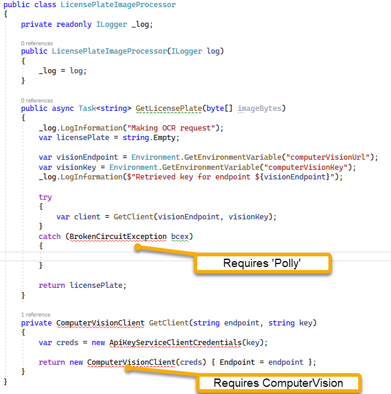
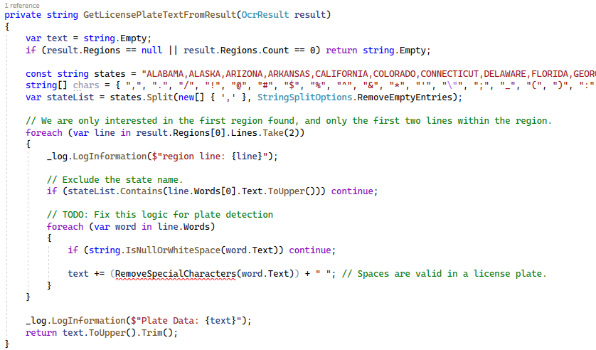
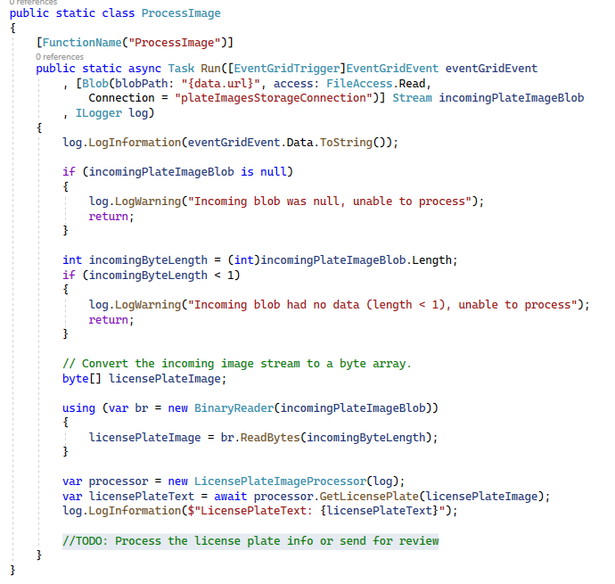

# Computer Vision

In this challenge, you will create the computer vision instance that will try to read license plates from vehicles.  Additionally, you will wire up code in your function app to handle the interaction with computer vision.

This walkthrough builds the region of the diagram below labelled with `3`:

  

## Task 1 - Create a new Computer Vision Instance

In this first task for challenge 3, you will provision a new computer vision instance.

1. Open Computer Vision

    Navigate to the portal and search for `Computer Vision`  

      

    On the computer vision blade, select `+ Create` to start the process to create and deploy a new computer vision instance

1. Configure the vision Basics

    Select the appropriate subscription and resource group, then choose your region of choice for this deployment.  

    For the name, give the vision service a name like: 

    ```text
    LicensePlateVisionService
    ```  

    You can use the Free tier, but note that this has limits (20 calls per minute/5k month).  You will therefore likely want to use the Standard tier (about $1 per 1000 calls).

    Acknowledge the Responsible AI Notice.  

      

    Hit the `Next: Network >` button.  

1. Review networking options

    Notice that there are options for deploying your vision service.  For this workshop, it will just be `All networks...` and go over public internet (with url and key for security).

    Hit the `Next: Identity` button.

1. Review Identity options

    You could give this vision service an identity if it needed to connect to your other azure services, like key vault.  However, the vision service will only be responding to requests and returning information, so there is no need for identity.

    Hit the `Review + create` button.

1. Validate and Create

    Wait for validation, then create the computer vision instance.

1. After deployment, get the endpoint and key

    Navigate to the Overview tab.  On the overview tab, note the `Endpoint` and `Manage Keys` options on the essentials.

    Copy the Endpoint to your clipboard and save it to a notepad or code file for later use.  Then click on the `Click here to manage keys` link.

      

    Alternatively, you can get the info from the `Keys and Endpoint` blade (the link just takes you there).  

1. Get one of the primary keys

    On the Keys and Endpoint blade, hit the `Show Keys` button.  Then copy `Key 1` and put it with your endpoint.  Note that the endpoint is here as well.

      

## Task 2 - Implement code in the Function app for Vision processing

In this second task, you will create the code in the function app to process the images using the Cognitive Services Vision endpoint.

1. Modify the LicensePlateProcessing project

    To process vision, a number of code changes will be necessary.  To save time, most of the code will be presented to you here.

    In the LicensePlateProcessing project, add a new folder called

    ```text
    VisionImageProcessingLogic
    ```  

    In the folder, add a new class called 

    ```text
    LicensePlateImageProcessor.cs
    ```  

      

1. Add the code for the processing logic.

    In the new class, replace the code with the following block of code:

    ```cs
    public class LicensePlateImageProcessor
    {
        private readonly ILogger _log;

        public LicensePlateImageProcessor(ILogger log)
        {
            _log = log;
        }

        public async Task<string> GetLicensePlate(byte[] imageBytes)
        {
            _log.LogInformation("Making OCR request");
            var licensePlate = string.Empty;

            var visionEndpoint = Environment.GetEnvironmentVariable("computerVisionUrl");
            var visionKey = Environment.GetEnvironmentVariable("computerVisionKey");
            _log.LogInformation($"Retrieved key for endpoint ${visionEndpoint}");

            try
            {
                var client = GetClient(visionEndpoint, visionKey);
            }
            catch (BrokenCircuitException bcex)
            { 
            
            }

            return licensePlate;
        }

        private ComputerVisionClient GetClient(string endpoint, string key)
        {
            var creds = new ApiKeyServiceClientCredentials(key);

            return new ComputerVisionClient(creds) { Endpoint = endpoint };
        }
    }

    ```  

    A number of references will need to be updated to fix this first block of code.  Additional code will be needed to complete the solution.  

      

1. Fix the errors in the first part of the code.  

    To get started fixing this code, add the NuGet Package:

    ```text
    Microsoft.Azure.CognitiveServices.Vision.ComputerVision
    ```  

      

    Next, add the reference to the `LicensePlateImageProcessor` class:

      

    Finally, add `Polly` by fixing the `BrokenCircuitException` with the suggestion to add `Polly`.  

      

    Ensure the project builds without error, then proceed.

1. Update the catch logic   

    Replace the catch logic with two catch blocks:

    ```cs
    catch (BrokenCircuitException bce)
    {
        _log.LogError($"Could not contact the Computer Vision API service due to the following error: {bce.Message}");
    }
    catch (Exception e)
    {
        _log.LogError($"Critical error: {e.Message}", e);
    }
    ```  

1. Add the logic to process the image with Computer Vision

    After the creation of the client, add the following code to process the image:

    ```cs
    // Analyze the URL image 
    var imgStream = new MemoryStream(imageBytes);

    var ocrResult = await client.RecognizePrintedTextInStreamAsync(detectOrientation: true, image: imgStream);

    var resultData = JsonConvert.SerializeObject(ocrResult);
    _log.LogInformation($"result: {resultData}");

    licensePlate = GetLicensePlateTextFromResult(ocrResult);
    _log.LogInformation($"LicensePlate Found: {licensePlate}");
    ```  

      

    Import the using statements for `System.IO` and `Newtonsoft.Json`

1. Add the function logic to get the plate from the result

    Add the following function in the class:

    ```cs
    private string GetLicensePlateTextFromResult(OcrResult result)
    {
        var text = string.Empty;
        if (result.Regions == null || result.Regions.Count == 0) return string.Empty;

        const string states = "ALABAMA,ALASKA,ARIZONA,ARKANSAS,CALIFORNIA,COLORADO,CONNECTICUT,DELAWARE,FLORIDA,GEORGIA,HAWAII,IDAHO,ILLINOIS,INDIANA,IOWA,KANSAS,KENTUCKY,LOUISIANA,MAINE,MARYLAND,MASSACHUSETTS,MICHIGAN,MINNESOTA,MISSISSIPPI,MISSOURI,MONTANA,NEBRASKA,NEVADA,NEW HAMPSHIRE,NEW JERSEY,NEW MEXICO,NEW YORK,NORTH CAROLINA,NORTH DAKOTA,OHIO,OKLAHOMA,OREGON,PENNSYLVANIA,RHODE ISLAND,SOUTH CAROLINA,SOUTH DAKOTA,TENNESSEE,TEXAS,UTAH,VERMONT,VIRGINIA,WASHINGTON,WEST VIRGINIA,WISCONSIN,WYOMING";
        string[] chars = { ",", ".", "/", "!", "@", "#", "$", "%", "^", "&", "*", "'", "\"", ";", "_", "(", ")", ":", "|", "[", "]" };
        var stateList = states.Split(new[] { ',' }, StringSplitOptions.RemoveEmptyEntries);

        // We are only interested in the first region found, and only the first two lines within the region.
        foreach (var line in result.Regions[0].Lines.Take(2))
        {
            _log.LogInformation($"region line: {line}");

            // Exclude the state name.
            if (stateList.Contains(line.Words[0].Text.ToUpper())) continue;
            
            // TODO: Fix this logic for plate detection
            foreach (var word in line.Words)
            {
                if (string.IsNullOrWhiteSpace(word.Text)) continue;

                text += (RemoveSpecialCharacters(word.Text)) + " "; // Spaces are valid in a license plate.
            }
        }

        _log.LogInformation($"Plate Data: {text}");
        return text.ToUpper().Trim();
    }

    ```  

    Make sure to bring in the using statements.  For simplicity, all currently referenced using statements are in the next block: 

    ```
    using Microsoft.Azure.CognitiveServices.Vision.ComputerVision;
    using Microsoft.Azure.CognitiveServices.Vision.ComputerVision.Models;
    using Microsoft.Extensions.Logging;
    using Newtonsoft.Json;
    using Polly.CircuitBreaker;
    using System;
    using System.IO;
    using System.Linq;
    using System.Threading.Tasks;
    ```  

      

1. Bring in the function to RemoveSpecialCharacters

    Add the `RemoveSpecialCharacters` function:

    ```cs
    private string RemoveSpecialCharacters(string str)
    {
        var buffer = new char[str.Length];
        int idx = 0;

        foreach (var c in str)
        {
            if ((c >= '0' && c <= '9') || (c >= 'A' && c <= 'Z')
                || (c >= 'a' && c <= 'z') || (c == '-'))
            {
                buffer[idx] = c;
                idx++;
            }
        }

        return new string(buffer, 0, idx);
    }
    ```  

1. Wire up the call to process the image

    The final step to make this work is to call the new code when an image is uploaded.  

    First, convert the `ProcessImage.Run` method to be async:

    ```cs
    public static async Task Run([EventGridTrigger]EventGridEvent eventGridEvent
            , [Blob(blobPath: "{data.url}", access: FileAccess.Read,
                Connection = "plateImagesStorageConnection")] Stream incomingPlateImageBlob
            , ILogger log)
    ```  

    You will need to bring in the using statement for `System.Threading.Tasks`.

    Next, add the following code to the method to check for null or 0 length on the incoming plate image blob:

    ```cs
    if (incomingPlateImageBlob is null) 
    {
        log.LogWarning("Incoming blob was null, unable to process");
        return;
    }

    int incomingByteLength = (int)incomingPlateImageBlob.Length;
    if (incomingByteLength < 1)
    {
        log.LogWarning("Incoming blob had no data (length < 1), unable to process");
        return;
    }  
    ```

    Next, add the code to convert the image and get the text:

    ```cs
    // Convert the incoming image stream to a byte array.
    byte[] licensePlateImage;

    using (var br = new BinaryReader(incomingPlateImageBlob))
    {
        licensePlateImage = br.ReadBytes(incomingByteLength);
    }

    var processor = new LicensePlateImageProcessor(log);
    var licensePlateText = await processor.GetLicensePlate(licensePlateImage);
    log.LogInformation($"LicensePlateText: {licensePlateText}");
    ```  

    Finally, add a statement to remind us that there is a bit more work to do in the future: 

    ```cs
    //TODO: Process the license plate info or send for review
    ```  

      

1. Push the changes to the repository.

    Ensure the project builds.

    Push your changes to the repository for automatic build and deploy.

## Task 3 - Set environment variables and test

In this task you will set the endpoint and key to appropriate environment variables and test the logic.

1. Add the key to KeyVault

    Navigate back to the portal, and add a new Secret to the KeyVault.  Use the following information to create your secret, replacing `<your-vision-api-key>` with the key you retrieved above.

    Secret Name:  

    ```text
    LicensePlateVisionAPIKey
    ```

    Secret Value: <your-vision-api-key>

      

    Get the Secret identifier into your clipboard and save it to notepad or a code file for use later.

      

1. Add the Environment variables to the function app

    Assuming your deployment worked earlier, your function app just needs the environment settings that you coded to be able to interact with the Vision API correctly.

    Note the code you wrote earlier:

    ```cs
    var visionEndpoint = Environment.GetEnvironmentVariable("computerVisionUrl");
    var visionKey = Environment.GetEnvironmentVariable("computerVisionKey");
    ```  

    The two new Application Settings on the Function app will need to have these exact names to map to your code.

    Navigate to the portal and add the two app settings:

    

    The visionEndpoint is the url for vision, and the key will be retrieved from KeyVault.

    Dress the keyvault secret URI as follows:

    ```cs
    @Microsoft.KeyVault(SecretUri=<your-secret-uri-here>)
    ```  

    Add the two environment variables. The endpoint is just the direct link:

    Name:

    ```text
    computerVisionUrl
    ```

    Value:

    ```text
    https://licenseplatevisionservice.cognitiveservices.azure.com/
    ```

    And the key is the KeyVault Reference:

    Name:

    ```text
    computerVisionKey
    ```

    Value

    ```text
    @Microsoft.KeyVault(SecretUri=<your-secret-uri-here>)
    ```  

      

    Save the settings and ensure the keyvault reference works as expected.

      


1. Test the changes

    Manually upload a couple of images to the storage account and validate the vision results look appropriate in the monitor of the function.

    When this is working, you will now see text information from the images in your output:

    

    Unfortunately, the first one I uploaded didn't read correctly, showing:
    `6TRJU14` as the plate when it should have been `6TRJ244`.  

    Trying a couple others also shows some issues, and a couple that work.

    Perhaps the best solution for now would be to mark everything as `for review` until our vision algorithm works.

    For now, however, the solution is working as expected and we will just run with this for our workshop (honing our vision algorithm is outside the scope of our learning here, but feel free to work on this on your own).  

## Completed

In this module, you were able to create a computer vision instance and use an azure function that is triggered by a blob storage created event to process the image and get the potential license plate information for the image.

The Vision service is mostly working, but the results are less than perfect for sure.

The next step will be to create two events that can be utilized to trigger different paths for processing license plate information.
