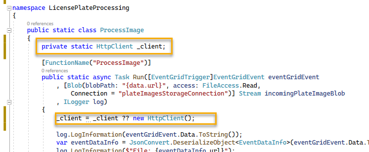

# Working with Events

In this challenge, you will create a custom event to push data to cosmos when the license plate is read successfully, and to a message queue for further processing when the plate data did not come in successfully. 

As there are a number of errors and things to consider, you will also parse the eventGridEvent data into an object and then utilize that for further help with processing images.

Unfortunately, we don't have real good results so far, but for our learning purposes we will just treat any license plate data that has between 5 and 7 characters (ignoring spaces) as good.  Less than 5 or more than 7 will be tagged for manual processing.

This walkthrough builds the region of the diagram below labelled with `4`:

  

## Task 1 - Get more information about the incoming file event

To get started, the first thing to do is to get the event data into a class that you can utilize.

One way to approach this is to look at the properties on the EventGridEvent class.  If you do this, you will note that there is a sub-property called `Data` which is already being conveniently logged when the function executes.

The logs, therefore, contain the json data that is in the eventGridEvent.Data property.

1. Open your Azure Function - Monitor for the ProcessImage function

    In this function, on the `Monitor` tab, choose `Invocations`.  In the invocations, review any of your successful log postings, and see that the data is logged for the eventGridEvent.Data property.  
    
    
    
    The data should be similar to the following output:

    ```json
    {"api":"PutBlob","clientRequestId":"faae231f-f041-45b4-a03d-90f0f8f820a0","requestId":"902aa45f-c01e-001a-19a3-70dfc3000000","eTag":"0x8DA3EBA88A80241","contentType":"image/jpeg","contentLength":9179,"blobType":"BlockBlob","url":"https://plateimages20231231blg.blob.core.windows.net/images/cali1.jpg","sequencer":"00000000000000000000000000009F92000000000104a442","storageDiagnostics":{"batchId":"eaa88d29-a006-0041-00a3-70e6f8000000"}}
    ```  

    Taking that json and putting it into a JSON to C# converter allows for a quick and easy translation to C# objects.  
    
    >**Note**: To keep it simple, we will not worry about casing and will just use the standard javascript method naming conventions.

    Open your browser to [Convert JSON to C# at json2csharp.com](https://json2csharp.com/) and then paste the JSON above or the JSON from your invocation into the left hand side, and then hit `convert`.  

      

    Copy the output to your clipboard for use in the functions project.

1. Create the C# object for EventGridData in your Functions project

    In the Functions project, create a new folder called `EventLogic` and add a new class to the folder called `EventDataInfo.cs`.  

    Paste the code from the conversion above into the file, and rename the `Root` to `EventDataInfo`

      

    The code should be similar to this:

    ```cs
    public class EventDataInfo
    {
        public string api { get; set; }
        public string clientRequestId { get; set; }
        public string requestId { get; set; }
        public string eTag { get; set; }
        public string contentType { get; set; }
        public int contentLength { get; set; }
        public string blobType { get; set; }
        public string url { get; set; }
        public string sequencer { get; set; }
        public StorageDiagnostics storageDiagnostics { get; set; }
    }

    public class StorageDiagnostics
    {
        public string batchId { get; set; }
    }
    ```  

1. Utilize the new data info in the ProcessImage function

    In the ProcessImage function, add the following four lines to the function immediately following the first line where the eventGridEvent.Data.ToString() is logged:

    ```cs
    var eventDataInfo = JsonConvert.DeserializeObject<EventDataInfo>(eventGridEvent.Data.ToString());
    log.LogInformation($"File: {eventDataInfo.url}");
    log.LogInformation($"contentType: {eventDataInfo.contentType}");
    log.LogInformation($"contentLength: {eventDataInfo.contentLength}");
    ```  

    Since you now have more information, you can also ensure that the file being sent to vision is an image file.

    Add the following logic to your function following the lines you just added above:

    ```cs
    if (eventDataInfo.contentType.ToLower() != "image/jpeg"
            && eventDataInfo.contentType.ToLower() != "image/png")
    {
        log.LogInformation("Blob content type is not valid for image processing, exiting gracefully");
        return;
    }
    ```  

    Check in your changes and push to GitHub to trigger a build.


1. Test the new logic to ensure it is working as expected.

    Upload a couple of images and review the logs to see the new event data being parsed successfully.

      


## Task 2 - Trigger an event from the vision result

Now that you have file information, you will first process and trigger an event from the "successful" vision result.

This process will be two-fold.  First you will fire an event from the ProcessImage function, and then you will create a function in the Portal that allows you to quickly and easily respond to the event to push the successful information into Cosmos (you'll do the second part in upcoming tasks in this challenge).  

1. Add a new models project

    In the future, you'll need to reuse a few objects to work with data from cosmos or from other messaging.  To handle common objects, create a new class library project.

    Name the project something like:

    ```text
    LicensePlateDataModels
    ```  

    Make it of type `Class Library`

    When the project spins up, rename `Class1.cs` as `LicensePlateData.cs`.

1. Modify the LicensePlateData.cs class

    Add the following code to the new LicensePlateData class:

    ```cs
    public class LicensePlateData
    {
        [JsonProperty(PropertyName = "fileName")]
        public string FileName { get; set; }

        [JsonProperty(PropertyName = "licensePlateText")]
        public string LicensePlateText { get; set; }

        [JsonProperty(PropertyName = "timeStamp")]
        public DateTime TimeStamp { get; set; }

        [JsonProperty(PropertyName = "licensePlateFound")]
        public bool LicensePlateFound => !string.IsNullOrWhiteSpace(LicensePlateText);

        [JsonProperty(PropertyName = "needsReview")]
        public bool NeedsReview => !LicensePlateFound 
                    || LicensePlateText.Replace(" ", "").Length < 5 
                    || LicensePlateText.Replace(" ", "").Length > 8;
    }
    ```  

    

    >**Note:** You will likely need to import NewtonSoft.JSON in order to use the `JsonProperty` tag

1. Add a project reference to the models project

    In the LicensePlateProcessing project, right-click and `Add Project Reference`.  Select the new Models project:

      

1. Add a new class to handle an Event

    In the LicensePlateProcessing project in the `EventLogic` folder, add a new class for `Event.cs`.  Place the following code in the class:

    ```cs
    public class Event<T> where T : class
    {
        [JsonProperty(PropertyName = "id")]
        public string Id { get; set; }

        [JsonProperty(PropertyName = "subject")]
        public string Subject { get; set; }

        [JsonProperty(PropertyName = "eventType")]
        public string EventType { get; set; }

        [JsonProperty(PropertyName = "data")]
        public T Data { get; set; }

        [JsonProperty(PropertyName = "eventTime")]
        public DateTime EventTime { get; set; }
    }
    ```  

1. Add a new class to handle triggering an Event

    In the EventLogic Folder, add another class to handle a request to trigger an event.  Name the class `TriggerEvent.cs` and add the following code to the file:

    ```cs  
    public class TriggerEvent
    {
        private readonly HttpClient _client;
        private readonly ILogger _log; 

        public TriggerEvent(ILogger log, HttpClient client)
        {
            _log = log;
            _client = client;
        }

        public async Task SendLicensePlateData(LicensePlateData data)
        {
            if (data.LicensePlateFound && !data.NeedsReview)
            {
                await Send("savePlateData", "PlateProcessing/TicketService", data);
            }
            else
            {
                await Send("reviewPlateData", "PlateProcessing/TicketService", data);
            }
        }

        private async Task Send(string eventType, string subject, LicensePlateData data)
        {
            // Get the API URL and the API key from settings.
            var uri = Environment.GetEnvironmentVariable("eventGridTopicEndpoint");
            var key = Environment.GetEnvironmentVariable("eventGridTopicKey");

            _log.LogInformation($"Sending license plate data to the {eventType} Event Grid type");

            var events = new List<Event<LicensePlateData>>
            {
                new Event<LicensePlateData>()
                {
                    Data = data,
                    EventTime = DateTime.UtcNow,
                    EventType = eventType,
                    Id = Guid.NewGuid().ToString(),
                    Subject = subject
                }
            };

            _client.DefaultRequestHeaders.Clear();
            _client.DefaultRequestHeaders.Add("aeg-sas-key", key);
            await _client.PostAsJsonAsync(uri, events);

            _log.LogInformation($"Sent the following to the Event Grid topic: {events[0]}");
        }
    }
    ```  

      

    >**Note**: Pay attention to the text in the `eventType` This will be important for filtering soon.  
     
1. Add a method in the ProcessImage function to fire the custom event.

    Open the `ProcessImage` function, and replace the line `TODO: Process the license plate info or send for review` with the following code:

    ```cs
    // Send the details to Event Grid.
    log.LogInformation($"Processing {eventDataInfo.url}");
    await new TriggerEvent(log, _client).SendLicensePlateData(new LicensePlateData()
    {
        FileName = eventDataInfo.url,
        LicensePlateText = licensePlateText,
        TimeStamp = DateTime.UtcNow
    });
    ```  

    Add a new static httpclient to the project before the [FunctionName("ProcessImage")]:

    ```cs
    private static HttpClient _client;
    ```  

    Bring in the missing using statement for `using System.Net.Http`

    Add the following line of code at the start of the function before logging the eventGridEvent.Data:

    ```cs
    _client = _client ?? new HttpClient();
    ```  

      

    Check in changes and push to GitHub to trigger build and deploy CI/CD Pipeline.   

## Task 3 - Create a Cosmos DB instance to store data

In this task, you will create the cosmos Db to store good license plate information.

1. Create a Provisioned CosmosDb

    The amount of use on this cosmos db will be minimal and you can delete it after today.  If you can you should use the free cosmos db that you get for your subscription. If you already have this deployed, just point to that cosmos instance, don't create another one. 

    >**Note:** I originally thought this would be cheaper on serverless.  I was entirely mistaken.  I ran up a HUGE bill using serverless for this so please DO NOT use a serverless cosmos db!  

    

    YIKES!

    Search for `cosmos db` and select `Azure Cosmos DB` to get started.

      

    Select `Create` and then choose the `Core (SQL) - Recommended` option and hit create:

      

    Choose your Subscription and Resource Group, and then set the instance details:

    Account Name: 

    ```text
    licenseplatedataYYYYMMDDxyz
    ```  

    Location: **`(US) South Central US`**  [use any region you can get to deploy]
    Capacity Mode: **`Provisioned Throughput`**

    Apply Free Tier Discount: **`Apply`**  [if you can, apply this, if not, make sure to limit RUs to 400 (~$25/month)]

      

    Hit `Next -> Global Distribution` and then on that blade, ensure all replication is disabled (avoid running up more costs!)

    Skip `Networking`

    On the `Backup Policy`, use

    Backup policy: `Periodic`
    Backup Interval: `1440`
    Backup retention: 48 hours or 2 Days
    Backup Storage Redundancy: `Locally-redundant backup storage` [least expensive]

      


    Hit `Review + create`, then wait for validation and then hit the `Create` button

      

    While the account is provisioning go on to the next task.

    >**NOTE**: At the time of this writing, in some cases, cosmos deployment will fail, especially for free tier.  IF this happens, you have to delete your cosmos account (it will create but state it is in a failed state).  Once you've deleted the failed account, try again on another region.  You don't need a fancy region because you aren't doing any backup or global redundancy, so just get it deployed somewhere relatively close to you.

## Task 4 - Create the custom events response function

To start, you will need to create a custom event topic.  This will be able to be triggered by the vision processing function to push data into cosmos.

The event target will be another azure function, written with node.js directly in the portal. You will create the function app in this task.

1. Create a new Azure Function app in the portal

    Navigate to the portal, search for `Function App` and create a new function app in your subscription and resource group with the following parameters:

    Function App Name: 

    ```text
    LicensePlateEventHandlerFunctionsYYYYMMDDxyz
    ```  

    Publish: **`Code`**  
    Runtime Stack: **`Node.js`**  
    Region: **`your-region`**  
    Operating System:  **`Windows`**  
    Plan Type: **`Consumption (Serverless)`**  

    Hit `Review + create`, validate, and create the new function app.

      

    While the function app is provisioning, return to the cosmos account

## Task 5 - Create Cosmos DB and Container, get keys

In this task you will configure your cosmos db with a database and a container for the good license plate information.

1. Create the Database and Container

    Navigate to your CosmosDb account, and select the `Data Explorer` tab.  Close the video/welcome.

    At the top, select `New Container` and then `New Container`.  

      

    In the right-side blade, add a new database

    ```text
    LicensePlates
    ```  

    **NonFreeTier:** If not on a free account, uncheck `Share throughput across containers`, and limit your container usage to 400 RUs.  
    
    **FreeTier:** If on the free account, leave the `Share throughput across containers` checked (unless you are going to do other things with this account later).

    **Free tier** only: Set the Autoscale to true and Max to 1000R/Us (free tier limit).

    And then add a container id

    ```text
    Processed
    ```  
    
    **Non-Free tier** only: Set the Autoscale on the container to `Manual` and Max to 400 R/Us (about $25/month)

    **Free Tier**  
      

    **Paid Tier**

      

    **Free Tier** Use Automatic indexing

    **Both Tiers** Set the partition key to be the filename:

    ```text
    /fileName
    ```  

    **Free Tier**  

      

    **Both Tiers**  

    You are all set, just hit `OK` to create the database and container.

1. Get the Endpoint and key information for the account

    To access and utilize this cosmos db instance, you will need the endpoint, the primary key, the database id, and the container id.  You just created the database and container ids.

    On the cosmos db account blade, find the left-nav item `Keys` and navigate to it.

    Get the read-write URI and Primary Key.  Copy them and paste them in a notepad or code file for use when creating output bindings for the event handler functions.

## Task 6 - Create the happy path success function

The first function you will create will place data into cosmos for plates that were successfully processed by vision and meet our simple criteria for length.

1. Create the successful processing function

    Navigate to the event handler functions you created, and then use the left-nav to select `Functions`.  On the functions blade, select `+ Create` to create the first function for this app.

    When the creation right-side input comes up, select

    Development Environment: **`Develop in Portal`**
    Template: **`Azure Event Grid Trigger`.

    **Make sure to name the function (you may need to scroll down)**

    New Function: **`SavePlateData`**

    Hit the `Create` button.

    
    
1. Code the function

    When the function is created, hit the `Code + Test` left nav and then in the code editor window, enter the following code:

    ```js
    module.exports = function(context, eventGridEvent) {
        context.log(typeof eventGridEvent);
        context.log(eventGridEvent);

        context.bindings.outputDocument = {
            fileName: eventGridEvent.data['fileName'],
            licensePlateText: eventGridEvent.data['licensePlateText'],
            timeStamp: eventGridEvent.data['timeStamp'],
            exported: false,
            confirmed: false
        };

        context.done();
    };
    ```  

      

## Task 7 - Add a new Event Grid subscription to process to cosmos

In this task you will wire up the event for success to push data through the function into CosmosDB.

1. Add a new EventGrid subscription to trigger the function

    In the portal, on the function for SavePlateData, hit the `Integration` tab.

    Hit the `Event Grid Trigger` to open the configuration on the right-hand side.

    

    When the Edit-Trigger blade comes up on the right, select `Create Event Grid Subscription` then enter the following information:

    Name: 

    ```text
    SavePlateDataSub
    ```  

    Event Schema: **`Event Grid Schema`**
    Topic Type: **`Event Grid Topic`**

    Use the tools to get your subscription and resource group, then select the same event grid topic you created earlier in this workshop.

    Source resource: **`your-eg-topic`**

    Under `Event Types` - `Filter to Event Types` hit the `Add Event Type` button.

    Here you will add the type that is exactly as you named it in the code for sending the event with the `Event Type`.  In this case, it is `savePlateData`.  

      

    Leave your endpoint selected and hit `Create`

1. Add the cosmos db output binding

    On the same Integration page where you just created the trigger, click on the `+ Add output` link in the `Outputs` section:

      

    Configure as follows:

    Binding Type: **`Azure Cosmos DB`**

    Cosmos DB account Connection -
    Select `new` then select your cosmos db you just created:

      

    Leave the Document parameter name as `outputDocument` and then set the `Database name` as `LicensePlates` (what you created earlier) and the collection name as `Processed` (also created earlier)  

      

    Hit `OK` to create the output binding.

1. Test the successful path

    You will need to have an image that correctly reads a plate and sends data with length between 5 and 7 characters.  

    Open both function apps to the monitor tab and also open the storage account for images to upload an image.  Choose the `Rocky58` plate image as this seems to work well.

    Upload it and validate that both functions fire successfully through event triggers.

      

1. Review data in Cosmos Db

    Navigate back to your cosmos db and then review the database and container to see the item(s) you have successfully processed:

      


## Task 8 - Create a new Service Bus Message Queue

In this task you will create a service bus message queue to put data that is not successfully processed into the queue for manual review.

1. Create the Namespace

    Navigate to the portal and search for `Service Bus`

      

    On the `Service Bus` blade, select `Create Namespace`

    On the `Create Namespace blade, configure on your subscription and resource group as follows:

      

    Namespace Name:

    ```text
    licenseplateprocessingYYYYMMDDxyz
    ```  

    Location: `your-region-choice`
    Pricing Tier: `Standard`

      

    Hit `Review + create`, wait for validation, then hit  `Create` to provision the Service Bus namespace.

1. Create the Queue

    For this part you could use either a Topic for Pub/Sub or a Queue.  Since there might be more than one admin processing plates it makes sense to just use a queue for FIFO processing.

    On the Service Bus Namespace blade, select `Queues` under Entities, then use the `+ Queue` to create a new queue.  

    For the name, call it `UnprocessedPlates`

    ```text
    UnprocessedPlates
    ```  

    Leave the default settings for Size, count, and TTL.

    Set the Lock duration to 2 min 30 seconds

    Enable duplicate detection and dead lettering

      

    Hit the `Create` button to provision the queue.

1. Create and get Queue Shared access policies

    In order to read or write, you will need to create a shared access policy.

    Drill into the queue, then click on `Shared access policies  then + Add.  

      

    When the right blade opens, name the policy `writemessages`

    ```text
    writemessages
    ```  

    Check the `Send` box, then `Create` the SAS Policy.

    Repeat for `readmessages`

    ```text
    readmessages
    ```  

    Check the `Listen` box, then `Create` the SAS Policy. 

    For each of the two queues, drill in and get the primary connection string

      

    >**Note:** Should you need the key later, you can get it from within the connection string.

## Task 9 - Write failed license plate messages to the service bus queue

In order to process failed plates in a disconnected environment, using the queue will create an ideal solution.  For this task, you'll leverage the code you already have in place to use an event trigger on failed image processing and place into a queue.

1. Create a new event handler function in the portal.

    In the `LicensePlateEventHandlerFunctions` add a new function called `QueuePlateDataForReview` that will respond to an event grid trigger (the same way as the SavePlateData function was created above).

      

    Hit `Create` and then when the function is deployed, navigate to the `Code + Test` blade.

    Enter the following code to handle the service bus processing:

    ```js
    module.exports = async function (context, eventGridEvent) {
        context.log(typeof eventGridEvent);
        context.log(eventGridEvent);

        var msg = '{' + 
                        '"fileName":"' + eventGridEvent.data['fileName'] + '", ' +
                        '"licensePlateText":"' + eventGridEvent.data['licensePlateText'] + '", ' +
                        '"timeStamp":"' + eventGridEvent.data['timeStamp'] + '", ' +
                        '"exported": false' +
                    '}';

        context.log('composed: ' + msg);

        context.bindings.outputSbMsg = msg;


        context.done();
    };
    ```

      

1. Set the integration for the input trigger

    On the `Integration` blade, click on `Event Grid Trigger` and then `Create Event Grid Subscription`

    When the Create Event Subscription blade comes up, name the new subscription as `ReviewPlateDataSub`:

    ```text
    ReviewPlateDataSub
    ```

    Event Schema: `Event Grid Schema`  

    Fill in the details to get to your topic that you've been using throughout the workshop.

    Add the `Filter to Event Types` to map to the event you coded earlier in the TriggerEvent.SendLicensePlateData method, which should be:

    ```text  
    reviewPlateData
    ```  

    Leave the input type and Endpoint as Azure Function/QueuePlateDataForReview.

    

    Hit `Create` to create the subscription.

1. On the Integration blade, create an output binding for Service Bus Queue

    Click on the `+ output` to bind output to the service bus queue.

    Select the details:

    Binding Type: **`Azure Service Bus`**
    Message Type: **`Service Bus Queue`**

    Create a new service bus connection to your recently created queue.

    

    >**Note**: the connection will use the RootManagedSharedAccessKey, which is the default key with all permissions (Read/Write/Manage).

    Set the `Message parameter name` to `outputSbMsg` and the QueueName to `UnprocessedPlates` to match the queue created above.

      

1. Test the integrations

    With the new code in place, upload a couple of images to the storage account that don't match our parameters.

    Monitor the QueuePlateDataForReview function to see it pushing messages into the Service Bus Queue.

    The `Ohio` plate generally fails as a good test case.

      

1. Review the Queue to see that it has received your message

    Navigate back to the queue and review to see the message count has increased:

      

    Try the Service Bus Explorer (currently in preview)  

      

## Completed

In this module, you created the cosmos db and service bus queue to store the message data for both processed and unprocessed license plates.

You created the event grid subscriptions to respond to the two events coded in the azure function.

When the function sends the `savePlateData` event type, you stored the data into Cosmos Db.  When the function sends the `reviewPlateData` event type, you put the data as a message into the service bus queue.
