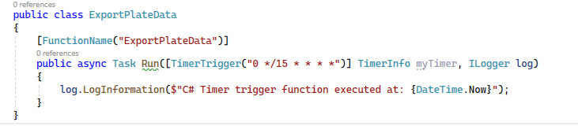

# Exporting Results

In this challenge, you will create a function that runs on a schedule.  The purpose of this function is to export any processed and confirmed plate information for import into the tickets database.

Since there have been a number of false positives, another export for unconfirmed records has been requested, and all data from those records needs to be queued for manual review.

Interested parties are concerned about the number of false positives and errors in the vision system and want a direct report when a new batch of unconfirmed but processed data is exported.

Therefore, your goal for this step is to create two export files, one for completed files and one for processed but unconfirmed.

To make it easier for downstream processing, completed files shall be named `YYYYMMDDHHMMSS_####_PlatesReadyForImport.csv` and files with processed but unconfirmed data will be named `YYYYMMDDHHMMSS_####_PlatesProcessedButUnconfirmed.csv`.  The `####` will be the number of records in the file, and the YYYYMMDDHHMMSS is just a timestamp for the file exports.

## Task 1 - Create the schedule triggered function.

To get started, you will add another function to the LicensePlateProcessing function app. In this task, you will create this function on a schedule to poll cosmos db and get all the records marked as unconfirmed and unexported.  

 >**Note:** Thinking about the architecture here reveals that polling the cosmos database may prove to be more cost effective on a provisioned account versus a serverless account. This should be examined further for the next revisions.

1. Create the new function

    In the `LicensePlateProcessing` function app, right-click to add a new Function.  Name the function:

    ```cs
    ExportPlateData.cs
    ```  

    When the New Azure Function window comes up, select `Timer trigger`.  The timer trigger is a CRON job. [Use this table to help you discern the timer syntax](https://docs.microsoft.com/en-us/azure/azure-functions/functions-bindings-timer?WT.mc_id=AZ-MVP-5004334&tabs=in-process&pivots=programming-language-csharp#ncrontab-expressions).  

    Change the schedule to:  

    ```cs 
    0 */15 * * * * 
    ```  
      

    This will trigger the function run 4 times an hour (every 15 minutes). 
    
    >**Note:** You may wish to change to 5 minutes for this workshop to expedite the exports `0 */5 * * * *`

    Update the generated function to be an `async Task` and add the `using System.Threading.Tasks;` using statement.

      

    If you wanted, you could deploy to test the functionality.

## Task 2 - Interaction with Cosmos DB

In order for this project to work, you'll need to interact with Cosmos DB.  In this task you'll set the code that allows querying and working with Cosmos data from .Net.

1. Add Logic for processing data from Cosmos using .Net

    Although you could wire up an input binding to Cosmos, this approach will show how to leverage cosmos from the .Net SDK.  

    Add a new folder under the function app called `CosmosLogic`.  In this folder, create a new class called `CosmosOperations.cs`  

    Add the following code to the `CosmosOperations` class:

    ```cs
    private readonly string _endpointUrl; 
    private readonly string _authorizationKey; 
    private readonly string _databaseId; 
    private readonly string _containerId; 
    private readonly ILogger _log;
    private static CosmosClient _client;

    public CosmosOperations(string endpointURL, string authorizationKey, string databaseId, string containerId, ILogger log)
    {
        _endpointUrl = endpointURL;
        _authorizationKey = authorizationKey;
        _databaseId = databaseId;
        _containerId = containerId;
        _log = log;
    }
    ```  

    You will need to add the using statement for the `Microsoft.Extensions.Logging` and you will also need to bring in the NuGet libraries for the CosmosDB to work with the DocumentClient.

        

    Ensure the project builds.

1. Create an object model for the LicensePlateDataDocument

    In order to leverage all the properties of the cosmos item, you need to create an object to model the data (including hidden fields like `id` and `eTag`).

    In the `CosmosLogic` folder, add a new class file called `LicensePlateDataDocument.cs`.  

    Add the following code to the new model:

    ```cs
    public class LicensePlateDataDocument
    {
        public string fileName { get; set; }
        public string licensePlateText { get; set; }
        public DateTime timeStamp { get; set; }
        public bool licensePlateFound { get; set; }
        public bool exported { get; set; }
        public bool confirmed { get; set; }
        public string id { get; set; }
        public string _eTag { get; set; }
        public string _rid { get; set; }
        public string _self { get; set; }
        public string _attachments { get; set; }
        public string _ts { get; set; }
    }
    ```  

1. Create a method to get data from Cosmos that either has or has not been confirmed and has not been marked as exported.  

    Note that the data will get exported once or twice, depending on its state and review processing. The following is a summary of expected states:

    Exported = 0 confirmed = 0 [needs exported for review - this is a vision entry!]  
    Exported = 1 confirmed = 0 [no export: Currently in review mode]  
    Exported = 0 confirmed = 1 [needs exported for confirmed - has been reviewed, may or my not be vision entry]  
    Exported = 1 confirmed = 1 [finalized, no processing or exporting needed]  

    Add a new method named `GetLicensePlatesToExport` that returns a `List<LicensePlateDataDocument>` as follows:

    ```cs
    /// <summary>
    /// Get the license plates that need exported
    /// </summary>
    /// <returns>list of all un-exported license plates</returns>
    public async Task<List<LicensePlateDataDocument>> GetLicensePlatesToExport()
    {
        _log.LogInformation($"Retrieving license plates that are not marked as exported");
        int exportedCount = 0;

        List<LicensePlateDataDocument> licensePlates = new List<LicensePlateDataDocument>();
        if (_client is null) _client = new CosmosClient(_endpointUrl, _authorizationKey);
        var container = _client.GetContainer(_databaseId, _containerId);
        
        using (FeedIterator<LicensePlateDataDocument> iterator = container.GetItemLinqQueryable<LicensePlateDataDocument>()
                .Where(b => b.exported == false)
                .ToFeedIterator())
        {
            //Asynchronous query execution
            while (iterator.HasMoreResults)
            {
                foreach (var item in await iterator.ReadNextAsync())
                {
                    licensePlates.Add(item);
                }
            }
        }

        exportedCount = licensePlates.Count();
        _log.LogInformation($"{exportedCount} license plates found that are ready for export");
        return licensePlates;
    }
    ```  

1. Add a method to mark the license plates as exported

    Use the following code to create the method that will mark the license plates as exported:

    ```cs
    /// <summary>
    /// Update license plate records as exported
    /// </summary>
    /// <param name="licensePlates"></param>
    /// <returns></returns>
    public async Task MarkLicensePlatesAsExported(IEnumerable<LicensePlateDataDocument> licensePlates, bool isConfirmed)
    {
        _log.LogInformation("Updating license plate documents exported values to true");
        if (_client is null) _client = new CosmosClient(_endpointUrl, _authorizationKey);
        var container = _client.GetContainer(_databaseId, _containerId);

        foreach (var licensePlate in licensePlates)
        {
            try
            {
                licensePlate.exported = true;
                licensePlate.confirmed = isConfirmed;
                var response = await container.ReplaceItemAsync(licensePlate, licensePlate.id);
                _log.LogInformation($"Updated {licensePlate.fileName} as exported");
            }
            catch (Exception ex)
            {
                _log.LogError($"Could not update {licensePlate.fileName}: {ex.Message}");
            }
        }
    }
    ```  

    >**Note:** once plates are confirmed they need to still be exported and the toggle will ensure that confirmed plates stay confirmed (even if that might be unnecessary).

    Don't forget to add the using statements to ensure the code compiles:

    ```cs
    using Microsoft.Azure.Cosmos;
    using Microsoft.Azure.Cosmos.Linq;
    using Microsoft.Extensions.Logging;
    using System;
    using System.Collections.Generic;
    using System.Linq;
    using System.Threading.Tasks;
    ```  

## Task 3 - Create a CSV in memory from data

In this task you'll create a helper class to generate CSV Files in memory from data.  You'll use this to upload to storage in a future task.

1. Create the CSV to Stream helper class

    Add a folder in the project called `StorageAndFileProcessing`.  
    
    ```text
    StorageAndFileProcessing
    ```  
    
    In this folder, create a new class file called `CreateCSVFromPlateDataInMemory.cs`

    ```text
    CreateCSVFromPlateDataInMemory.cs
    ```  

    In the new class file, add the code to `CreateCSVStreamFromPlateData`

    ```cs
    public async Task<byte[]> CreateCSVStreamFromPlateData(IEnumerable<LicensePlateDataDocument> data)
    {
        using (var stream = new MemoryStream())
        {
            using (var textWriter = new StreamWriter(stream))
            {
                using (var csv = new CsvWriter(textWriter, CultureInfo.InvariantCulture, false))
                {
                    csv.WriteRecords(data.Select(ToLicensePlateData));
                    await textWriter.FlushAsync();
                    stream.Position = 0;
                    var bytes = stream.ToArray();
                    return bytes;
                }
            }
        }
    }

    /// <summary>
    /// Used for mapping from a LicensePlateDataDocument object to a LicensePlateData object.
    /// </summary>
    /// <param name="source"></param>
    /// <returns></returns>
    private static LicensePlateData ToLicensePlateData(LicensePlateDataDocument source)
    {
        return new LicensePlateData
        {
            FileName = source.fileName,
            LicensePlateText = source.licensePlateText,
            TimeStamp = source.timeStamp
        };
    }
    ```  

    >**Note:** this code will required bringing in another NuGet Package for `CsvHelper`

    

    Additionally, you'll need to add the using statements to ensure the code compiles as expected.

    ```cs
    using CsvHelper;
    using LicensePlateDataModels;
    using LicensePlateProcessing.CosmosLogic;
    using System.Collections.Generic;
    using System.Globalization;
    using System.IO;
    using System.Linq;
    using System.Threading.Tasks;
    ```  

## Task 3 - Create the helper for working with Azure Storage

In this task, you will create code to interact with Azure Storage.  

1. Import Azure Storage Blobs NuGet package

    To get started, grab the Azure.Storage.Blobs NuGet Package.

      

1. Create the storage blob interaction helper class

    In the `StorageAndFileProcessing` folder, add another class file `BlobStorageHelper.cs`  

    ```text
    BlobStorageHelper.cs
    ```  

    In the new class, add the following code:

    ```cs
    public class BlobStorageHelper
    {
        private readonly string _containerName;
        private readonly string _blobStorageConnection;
        private readonly ILogger _log;

        public BlobStorageHelper(string connectionString, string containerName, ILogger log)
        { 
            _blobStorageConnection = connectionString;
            _containerName = containerName;
            _log = log;
        }

        public async Task<bool> UploadBlob(byte[] blobBytes, string fileName)
        {
            var ms = new MemoryStream(blobBytes);

            // Create a BlobServiceClient object which will be used to create a container client
            var blobServiceClient = new BlobServiceClient(_blobStorageConnection);

            // Create the container and return a container client object
            var containerClient = blobServiceClient.GetBlobContainerClient(_containerName);
            var blobClient = containerClient.GetBlobClient(fileName);

            _log.LogInformation($"Uploading to Blob storage as blob:{Environment.NewLine}{blobClient.Uri}\n");

            // Upload data from the stream
            var result = await blobClient.UploadAsync(ms, true);
            var success = result.GetRawResponse().Status == 201;
            _log.LogInformation($"Successful Upload: {success}");
            return success;
        }

        public async Task<byte[]> DownloadBlob(string fileName)
        {
            // Create a BlobServiceClient object which will be used to create a container client
            var blobServiceClient = new BlobServiceClient(_blobStorageConnection);

            // Create the container and return a container client object
            var containerClient = blobServiceClient.GetBlobContainerClient(_containerName);
            var blobClient = containerClient.GetBlobClient(fileName);

            _log.LogInformation($"Downloading blob as byte array from {blobClient.Uri}");

            // Download the blob's contents and save it to a stream
            var stream = new MemoryStream();
            await blobClient.DownloadToAsync(stream);
            stream.Position = 0;
            _log.LogInformation($"{stream.Length} bytes received");
            return stream.ToArray();
        }
    }
    ```  

    This code will provide methods to interact with blob storage at the byte[]/memory stream level.

## Task 4 - Query cosmos to get the data for the two exports, generate files, export to storage, and mark the data as exported

In this task you'll modify the ExportPlateData function to create the two exports using the helpers created above.

1. Add the code to get the export data

    Replace all of the code in the ExportPlateData class with the following:

    ```cs
    public class ExportPlateData
    { 
        private static string ReadyForImportFileName = "YYYYMMDDHHMMSS_####_PlatesReadyForImport.csv";
        private static string ReadyForReviewFileName = "YYYYMMDDHHMMSS_####_PlatesProcessedButUnconfirmed.csv";

        [FunctionName("ExportPlateData")]
        public async Task Run([TimerTrigger("0 */15 * * * *")] TimerInfo myTimer, ILogger log)
        {
            log.LogInformation($"C# Timer trigger function executed at: {DateTime.Now}");
            log.LogInformation("Finding license plate data to export");

            var cosmosEndpointURL = Environment.GetEnvironmentVariable("cosmosDBEndpointUrl");
            var cosmosDbAuthorizationKey = Environment.GetEnvironmentVariable("cosmosDBAuthorizationKey");
            var cosmosDatabaseId = Environment.GetEnvironmentVariable("cosmosDBDatabaseId");
            var cosmosContainerId = Environment.GetEnvironmentVariable("cosmosDBContainerId");

            var container = Environment.GetEnvironmentVariable("datalakeexportscontainer");
            var storageConnection = Environment.GetEnvironmentVariable("datalakeexportsconnection");

            int exportedConfirmedCount = 0;
            int exportedNonConfirmedCount = 0;
            var timeStamp = DateTime.Now.ToString("yyyyMMddhhmmss");

            //create the cosmos helper:
            var cosmosOperations = new CosmosOperations(cosmosEndpointURL, cosmosDbAuthorizationKey, cosmosDatabaseId, cosmosContainerId, log);

            //get plates to export
            var licensePlates = await cosmosOperations.GetLicensePlatesToExport();
            
            if (licensePlates != null && licensePlates.Any())
            {
                log.LogInformation($"Retrieved {licensePlates.Count} license plates");
                //get confirmed and unconfirmed plates:
                var confirmedPlates = licensePlates.Where(x => x.confirmed);
                var nonConfirmedPlates = licensePlates.Where(x => !x.confirmed);
                exportedConfirmedCount = confirmedPlates.Count();
                exportedNonConfirmedCount = nonConfirmedPlates.Count();

                //create a csv helper
                var createImportsCSVInMemory = new CreateCSVFromPlateDataInMemory();

                //create a storage helper
                var sh = new BlobStorageHelper(storageConnection, container, log);

                var success = false;
                if (confirmedPlates != null && confirmedPlates.Any())
                {
                    //get confirmed plates file name:
                    var fileNameReadyForImport = ReadyForImportFileName.Replace("YYYYMMDDHHMMSS", timeStamp).Replace("####", exportedConfirmedCount.ToString().PadLeft(4, '0'));

                    //get imports (confirmed plates) into memory stream csv
                    var readyForImportCSVStream = await createImportsCSVInMemory.CreateCSVStreamFromPlateData(confirmedPlates);

                    //upload to storage
                    success = await sh.UploadBlob(readyForImportCSVStream, fileNameReadyForImport);
                    if (success)
                    {
                        //mark as exported
                        await cosmosOperations.MarkLicensePlatesAsExported(confirmedPlates, true);
                        log.LogInformation($"Confirmed plates marked as exported and exported to file {fileNameReadyForImport}");
                        //report counts
                        log.LogInformation($"Exported {exportedConfirmedCount} confirmed license plates");
                    }
                }

                if (nonConfirmedPlates != null && nonConfirmedPlates.Any())
                {
                    //get reviewable plates into memory stream csv
                    var fileNameReadyForReview = ReadyForReviewFileName.Replace("YYYYMMDDHHMMSS", timeStamp).Replace("####", exportedNonConfirmedCount.ToString().PadLeft(4, '0'));
                    var readyForReviewCSVStream = await createImportsCSVInMemory.CreateCSVStreamFromPlateData(nonConfirmedPlates);

                    //upload to storage
                    success = await sh.UploadBlob(readyForReviewCSVStream, fileNameReadyForReview);
                    if (success)
                    {
                        //mark as exported
                        await cosmosOperations.MarkLicensePlatesAsExported(nonConfirmedPlates, false);
                        log.LogInformation($"Reviewable plates marked as exported and exported to file {fileNameReadyForReview}");
                        log.LogInformation($"Exported {exportedNonConfirmedCount} license plates for review");
                    }
                }
            }
            else
            {
                log.LogWarning("No license plates to export");
            }

            log.LogInformation("Completed processing of plates");
            return;
        }
    }
    ```  

    The code makes calls to Cosmos using the Cosmos helper to get the various license plates for each file type, then gets that data into a CSV file in memory using the CSV helper, and then uses the blob storage helper to upload the files to storage.

    Take some time to review the code.

    >**Additional Note:** The cosmos performance on this code is not ideal (each replace is likely around 11 RUs).  You woule likely want to avoid code that is this under-performant in production without expecting to pay extra for the lack of optimized queries and indexes.

## Task 5 - Update the cosmos and storage information in the function app

Before deploying, you will want to make sure that the variables for cosmos and your storage account are set correctly in the Azure Function App Configuration.

For this application to work, you will need to add six application configuration settings (if you didn't add any of them previously).  They are all listed at the top of the ExportPlateData function call, but specifically, they are:  

| ApplicationSetting | Expected Value |
|--|--|
| cosmosDBEndpointUrl | The endpoint for your cosmos db instance |
| cosmosDBAuthorizationKey | The Key for your cosmos db instance (from keyvault) |
| cosmosDBDatabaseId | The name of your cosmos db (likely named `LicensePlates`) |
| cosmosDBContainerId | The name of the container (likely named `Processed`) |  
| datalakeexportsconnection | The connection string to your datalake storage account set to a Keyvault URI. The account was created in Challenge 1 as `datalakeexports` (not the images storage account) |  
| datalakeexportscontainer | The name of the container for exports from the `datalakeexports` account(likely named `exports`)  

1. Retrieve the information for the six settings

    Get the values for each of the six settings as above. 

    Place the value for the Cosmos DB Authorization Key and the Storage Connection String into KeyVault and get the URI for each secret, and then wrap the URI with the following:

    ```text
    @Microsoft.KeyVault(SecretURI=...)
    ```  

    Use that value when adding to application settings for the function app.

    The current state of the KeyVault should look similar to the following:

      
    
1. Place the six values into the configuration for the function app.  

    To prep, use the gathered information from above and the wrapped keyvault entries and have them handy. 

    For example, I put them into notepad: 

      

    Navigate to the LicensePlateProcessing function app, then select the `Configuration` blade, and add the six new settings:

      

    >**Important!** Don't forget to double-save this (hit save) or your settings will not be officially applied.  To confirm, navigate off the Configuration blade and ensure you don't get warned about losing changes.

    Come back to the settings and ensure they are still there, and KeyVault references are confirmed with a green checkmark:

      

## Task 6 - Deploy the function app

Provided that your changes are effectively correct and everything is in place, deployment of the function app should allow the major processing to start coming together.

With these changes, you'll have the handlers in place for images being uploaded and then vision will push to cosmos or the service bus queue as expected. 

These changes will now allow for the data that in not exported in cosmos to be translated into a CSV and uploaded into the data lake storage account on a function that runs on a timer trigger (every 15 minutes).  

1. Check in your changes.

    Ensure your function app builds without error.

    Commit and push the changes so the CI/CD pipeline can deploy the function app with your changes.

    Remember that this will have a timer trigger, so you might have to wait up to 15 minutes for the first execution.  If you can't wait, you could run the trigger every 5 minutes or so with a simple change to the cron timer.

1.  Test the solution to this point

    While everything is building and deploying, ensure you have some images ready to go, and then when the build completes and deploys, upload a few images to the image storage account to allow for processing to start.

    You can validate that there are some non-exported plates with the following query

    ```sql
    SELECT * FROM c WHERE c.exported = false
    ```  

      

    Make sure to have the function open for monitoring so you can see if any errors occur or get confirmation that the exports were created and uploaded to blob storage.

1. Validate that the files were exported to Storage.

    Open the storage account and download any file that was created and validate the data inside of it makes sense for what you were expecting to see.

    First, the log shows expected results:

      

    Second, the cosmos query above returns 0 records:

    

    Finally, data is exported to a CSV (retrieve with SAS or download from the portal):

      

## Completed

You have completed this challenge.  In this challenge, you learned how to get the data from cosmos into a CSV file and you worked with the .Net SDK to query cosmos database.  

You also learned how to use the .Net SDK to interact with blob storage to upload the files.

At completion, you now have a scheduled function that runs every 15 minutes to query the cosmos db table for any new license plate data as entered by successful computer vision or manual review out of the service bus queue.
