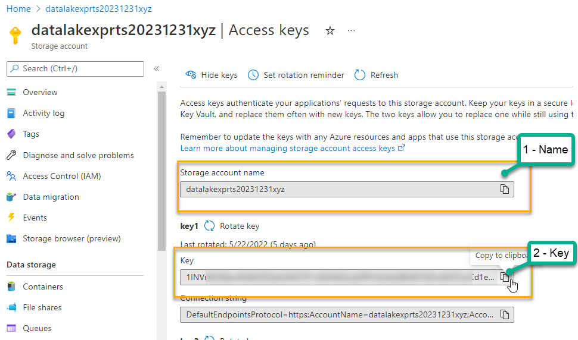
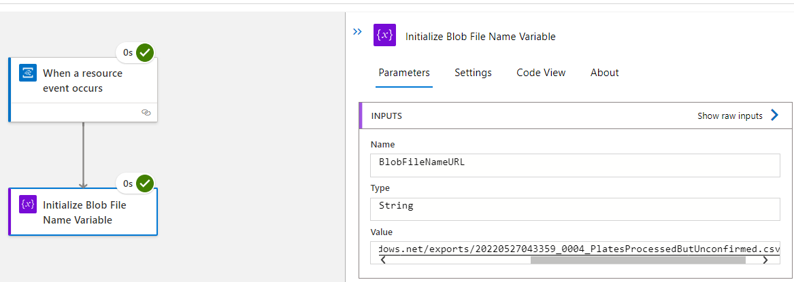

# Handling data and sending notifications

In this challenge you will use a logic app to respond to storage events.  On the storage event, you will respond to the file based on the naming convention previously established.

After parsing the file name, you will send an email to the interested parties with the number of records that were marked as processed but not confirmed, and therefore pushed into Cosmos as supposedly correct.

In addition to sending the email, based on the file naming convention you will trigger a function to either push data to a SQL Database (data is marked as confirmed) or push the data to the Service Bus Queue for manual review (data is marked as exported but not confirmed).  

The function will need data about the file in order to process it from storage directly. The processing of the file by the functions will be completed in the next challenge, but this challenge should trigger the appropriate functions per each file and post the data to the function so that the function can make appropriate calls to storage to get the correct files.  

>**Note:** You've already learned about most of what you'll do in this challenge, other than logic apps.  However, the reason the remaining challenges exist is to help give additional learning around ways to integrate the tools at Azure.  You should not just assume that these challenges are repetitive from the first few challenges.

## Task 1 - Create the logic app to fire on create blob in storage  

In this task, you will create the logic app that will respond to blob creation events in storage.  

1. Use the built-in events wiring from storage

    In earlier challenges, you were able to create EventGridTopics and EventGridTopicSubscriptions using their specific blades in Azure. In this challenge, you will take a different approach.

    Navigate to your datalake storage account where you just uploaded csv files in the previous challenge.  

    On the left-nav, find the `Events` item and click it to start the process of creating events from the storage account.

    On the events blade, select `Logic Apps` and then under `When a new blob is uploaded` select `Create`.

      

    This will take you into the Logic Apps Designer.  Here, your first step will be to get signed in to both the Blob Storage and the Event Grid to create API connections that the logic app will use behind the scenes:

      

    Click on `sign in for `Blob Storage` then click on `Azure Blob Storage` on the next screen:

      

    In the blade that opens on the right, add a connection name, something like: 

    ```text
    DatalakeCSVUploadProcessing
    ```  

    Use the authentication type of `Access Key`.  For the Name and key, you will need your datalake storage and key.  The key is part of the connection string, but it is likely easier to just open another tab and get the details from the storage account, including `name` and `key.`

      

    Place the values in the appropriate spots and then create the connection:

      


    Next, click on `Sign in` for the `Azure Event Grid`.  

      

    Then click on `Azure Event Grid`

      

    Select the correct `Tenant` (you likely only have the `Default Directory`), then click `Sign in`

      

    Note that you could also connect via service principal or managed identity.  This would be useful to prevent being only able to work based on your rights, but rather based on another object managed in RBAC that is not based on your individual sign-in.

    When prompted, log into your account to create the connection.  

    Once this is completed, you'll see both connections created:

      

    Hit `Continue` to navigate to the logic app.

1. Save and name the logic app

    Although it's not ready, saving now prevents losing anything.  Additionally, the subscription will be created behind the scenes.

    >**Important**: this is the only chance you get to name the logic app.  Once you save it, the logic app name is immutable.  

    Hit the `Save As` button to save the logic app.

      

    Give it a very descriptive name like

    ```text
    Serverless-Workshop-CSV-Upload-Event-Processor
    ```  

    

    >**Note:** Including Log Analytics is currently optional.  If you want to do this, you need a workspace prior to creation.  Keep this in mind as in a production scenario you would likely want to have the ability to query your analytics, but you may not want the output in a shared workspace.

1. After saving, ensure the logic app is there

    The blade will continue to tell you that you will lose changes

    

    So ensure it was created:

      

    Additionally, you can open a new tab and browse to logic apps to see it listed and even drill into it:

      

    Feel free to close the other tab, even though it says you will lose changes.  

    >**Note**: this is why I like to save it right away.  Imagine you were working on this for an hour or two and this happened.

1. Ensure your event subscription is created

    One time I did this and event grid wasn't enabled.  I didn't realize that and spent a couple of hours trying to figure out why my logic app was never triggered on blob storage creation.

    Navigate back to the storage account and select the `Events` blade.  If you were already there, refresh the page.  You may need to refresh the page either way.

    When you get to the events, now you should see the subscription.

    

    Note that the current types are created and deleted.  You'll change that shortly.

    If you do not see the subscription, something is wrong and you need to redo the previous steps.

## Task 2 - Get a SendGrid account and API Key

In this task, you'll get a SendGrid account and validate the email domain to actually send email.  You can get 100 free emails a day from SendGrid.  

Once you have an account, you will get an API key to send emails.

Alternatively, you can try to wire up your Gmail or Microsoft account - all of these connectors are available in the logic app. The only path supported in this walkthrough is the SendGrid approach (so you're on your own if you go rogue).  

1. Get a SendGrid Account

    In order to complete this task, you'll need a SendGrid account.  You can [get one here](https://signup.sendgrid.com/).  

    

    Once you get signed in, you can work with your account.  To get back in or if you can't get to your account for some reason, remember that link is [https://app.sendgrid.com](https://app.sendgrid.com/)

    >**Note**: You will need to validate your email to send emails from SendGrid.  I was able to do this with a simple outlook account so you should not have to have domain ownership to get validated to send email.

1. Create an API Key

    To send email, you need an API Key. Navigate to the  API Keys

     

    On this page, select `Create API Key`

      

    Give the key a name like `SendServerlessEmails`

    ```text
    SendServerlessEmails
    ```  

    Then select `Restricted Access`
    
      

    Next, expand `Mail Send` and click the circles to move the progress bar.  This may be too much access, but give full access for Send and Schedule Sends:

      

    Scroll down and hit the `Create & View` button.

    This will take you to your sendgrid API Key Created page

    Copy this key - this is the only time you'll see it.  Clicking the key makes it able to be copied:

      

    You might want to put it in notepad for now, just in case.  

1. Place your key in KeyVault

    To keep your key secure and also so that you don't lose it, immediately open KeyVault in another tab and create a secret for the new API Key.  Navigate to your keyvault, then add a new secret:

     

    Save the key in your vault, then view it and ensure the key is set correctly.

      

    Copy the URI for this KeyVault key.

## Task 3 - Build the logic app and Send an Email

In this task, you will clean up the trigger event and then put the orchestration actions in place to send an email via SendGrid.  

1. Return to your logic app, change trigger events, delete the current path split and logic.

    Navigate back to your logic app in the portal.  Click on the `Logic app designer` view to see your workflow.

      

    On the logic app, right-click and delete the conditional workflow.  

      

    Confirm the delete. This will leave only the trigger connector/action.

    Save your changes.  Do this often (logic apps are versioned automatically!)  

    Click on `Versions` to see your choices.  You could restore the previous version if you decided you wanted that logic back!

      

    >**Note** the versions are not named, so you will have trouble finding your versions the more you create, but you can use general timestamps and such to find the ones you want.  If you click on it, it opens in a history mode, and you have to `Promote` it to get it back.  

    **Don't do this**, but this is what it looks like if you wanted to restore:

      

    On the logic app, click on the `When a resource event occurs` (which should be the only connector/action you have at this point).  This will expand it.

      

    Use the dropdown to select the `Microsoft.Storage.BlobCreated` event.

    Click back on the main canvas anywhere in the gray to close the event pane.

      

    Save the logic app.  Now is a good time to test.

1. Test the logic app.

    You will want to test often for two reasons.  One, you can see that it is working, and two, you can review the flow to see what happened to help make further actions work properly.

    Ensure you saved the logic app, then drop any file into your datalake storage acccount.  

      

    This will trigger the logic app.

    Return to your logic app and hit the `Overview` blade.  You should see a successful run on the Status in the bottom middle:

      

    Click on the run to see the details, and hit the connector for the event to expand it:

      

    Go back to storage and delete your file.  Ensure this does not trigger another run of your logic app.  You only care about creation events for this workflow.

1. Create a variable to get the blob url.

    In this design, you created a filename that can be parsed to find the number of plates that were exported.  This will work for either file.

    Begin by creating a variable to store the result.  In the logic app, on the designer, after the connector action, click the `+` to create a new action.  On the choose an operation blade, type `Variable`, then select `Initialize Variable`

    ```text
    Initialize Variable
    ```  

      

    Select it, then change the parameters as follows:

    Change `Initialize Variable` to 
    
    ```text  
    Initialize Blob File Name Variable
    ```  
    
    Change the variable `Name` to  

    ```text
    BlobFileNameURL
    ```  

    Set the type to `String`

      

    For the value, it's trickier, so save this and then drill back in so that you won't lose the first part if you have to try again.

1. Set the value of the Blob Name Variable

    Open the variable you just saved (it may still be open).  

    Click on the `Value` area.

    Select `Expression`

    From the expressions, select `string(value)` 
    
      

    Place the cursor inside of the string's value parens, and then select the `Dynamic Content` tab.  From there, select `Event Data`

      

    Ensure your content has 

    ```text
    string(triggerBody()?['data'])
    ```  
    
    As the value and hit `OK`

      

    The value has the red `string(...)` in it.  
    
    Save your changes.

    Return to the Overview tab, and select your previous run, then hit `Resubmit`.  It will not matter that the file is deleted.

      

    Return to the overview, review your previous runs, then expand the last successful run.  Click on the variable you just set, and you should see the value set to something like:

    `{"api":"PutBlob","clientRequestId":"9f58ac0e-7131-412c-b97c-e8461b155010","requestId":"c8e8d436-501e-0067-59e3-718368000000","eTag":"0x8DA3FFAEB8B7C70","contentType":"image/jpeg","contentLength":88994,"blobType":"BlockBlob","blobUrl":"https://datalakexprts20231231xyz.blob.core.windows.net/exports/1652025333680.jpg","url":"https://datalakexprts20231231xyz.blob.core.windows.net/exports/1652025333680.jpg","sequencer":"000000000000000000000000000194ee0000000000011b7d","identity":"$superuser","storageDiagnostics":{"batchId":"ba9e89e6-2006-0063-00e3-7176ea000000"}}`  

      

    Obviously, what you really want is just the `blobUrl`.  If you wanted all of this, you could use it and get further information just like you just did by getting values from it the same way.

    For simplicity, however, you should just parse out the blobURL right away.

1. Get just the blob URL

    Navigate back to the designer and expand the initialize.  Notice that the value is now set to `Event data`.  That's no good. We lost our string!

      

    Hovering shows that it is the trigger body text (see the image).  Since we didn't do anything fancy, it just put it to the thing we should have selected originally.

    On the left-nav, click on `Logic app Code view`.  Say `OK` if it says you will lose changes.

    Here you see the JSON that backs the entire logic app.

    Find the text `triggerBody()?['data']`

      

    Oh cool, the value is still there.  Also, while we're here, let's parse this down to just the blob URL.

    Change that line from: ```"value": "@{string(triggerBody()?['data'])}"`  to

    ```text
    "value": "@{string(triggerBody()?['data']['blobUrl'])}"
    ```  

      

    and then hit Save.  You just modified the logic app code - and it works just like you modified it on the designer!

    Go back to the Logic app designer and expand the variable again.

      

    Return to the overview and drill into your last run and resubmit.

    After a minute, return to the overview and then drill into the latest run.

    Review the values as before, and you should see the blobURL is fully captured.

      

1. Trigger with an actual CSV with a number.

    For this step, you could trigger from the start by uploading an image and waiting for your function app to process.  If you do this, ensure your function app is enabled.

    It is likely easier to just upload a csv with the name and data you want at this point, so find one in your storage from the previous task, and download it.
    
      

    Next upload it again (overwrite).  
    
    This will trigger the logic app as expected, and you'll be able to see the full URL for parsing out the number of records.

      

    What we really care about is that number in the `_00xx_` part of the filename.

    Return to the logic app designer, and then add another `Initialize Variable`.  I do want to call out here you could do this all in one step, but we'll need the url later, and this is easier to compose for our training purposes.  Reasons to only use one variable are due to the cost of executing an additional action on every run.

    Change the title to

    ```text
    Initialize Number of Plates Variable
    ```  

    Then set the name as

    ```text
    NumberOfPlates
    ```  

    Set the type to string (you could parse to int if you really want to but we just need the string).

    For the value, you're going to split on the `_` and get the index 1 entry.  This is as code-ish as you'll get in a typical logic app.

    Use the `see more` in the `expression` for `strings` and find the `split` operation:

    

    You can put your cursor in the `()s` for the `split` function and then select `Dynamic Content` and then select the `BlobFileNameVariable` if you want. Then use the "_" as your separator

      

    You can also just type:

    ```text
    split(variables('BlobFileNameURL'), '_')
    ```  
    And you will get the same result.

    Hit ok, then save the changes, and then follow the process to resubmit your last run.  Let's see what's in this value.

    The split should work, and you should see:

    ```javascript
    ["https://datalakexprts20231231xyz.blob.core.windows.net/exports/20220527043359","0004","PlatesProcessedButUnconfirmed.csv"]
    ```  

      

    Now you just need the entry from index 1 here.

    This is not as trivial as it seems, but really you just need to compose a few functions, including take(array, 2) and then the last of those... `last(take(...., 2))`

    Replace the expression with the following (you can compose this with expressions if you want)

    ```text
    last(take(split(variables('BlobFileNameURL'), '_'), 2))
    ```  

    Using this will get the split, then just take the first two, then just select the last entry which is the value you need.

      

    Update and save.  Then follow the process to resubmit your last run.  This time, you should be able to drill in and see the exact value you are looking for.

      

    The number is now captured.

1. Authorize your logic app to your KeyVault Secrets

    While the file is being parsed, you can also be getting your sendgrid API Key from KeyVault.

    To make this happen, you need the logic app to have a managed identity and you need to give it secret access on the KeyVault.

    On the left nav, find `Identity`. Click identity and then set the `System Assigned` managed identity to `On` Save your changes and ensure you get an object principal ID.

      

    Copy the `Object (principal) id` to your clipboard.

    Next, navigate to your KeyVault and add the new logic app managed identity to the access policies. 

      

    Configure `Secret Management` then block to just the `Get` Secret permissions.  Select `None Selected` to add the object principal to this policy.  Use your copied principal id to give access to your logic app.

      

    Select, then add, then Save!

      

    Navigate away and come back to the policies and hit refresh to ensure the policy is applied as expected.

1. Get the SendGrid API Key from KeyVault.

    Now that you are authorized, you just need to create an action to get the value from KeyVault.

    You can do this while the file name is being parsed.

    Return to your logic app designer.  

    Click on the plus under the event action and select `Add a parallel branch`

    For the Operation, type

    ```text
    Key Vault
    ```  

    Then select `Get Secret`

      

    When the configuration blade appears, instead of `Sign in`, hit `Connect with managed identity (preview)`  

    For the connection name, type

    ```text
    LogicAppToKeyVaultServerlessConnection
    ```

    Add the name of your vault (something like WorkshopVaultYYYYMMDDxyz).

    And then select the `System-assigned managed identity` and hit `Create`

    

    Provided that works, you'll see a dropdown with secret names.  Note that you are Forbidden from listing. This is a GOOD thing!  This means I have to know exactly the name of a secret to get it and I can't go spelunking for more secrets that I would have access to by default.

      

    Enter the value of your secret name (should be SendGridAPIKey)

      

    Save your logic app and test it to see if you get any errors for the Key Vault integration.

      

    Obviously this is a concern that you can see this key in plain text.  For this training, we'll move on and fix it in a minute as you'll see.

    Return to the designer.

1. Use the SendGrid connector to send an email.

    Bring the two paths back together by clicking on the final plus at the bottom and add another action to send an email.

    Select the `SendGrid` connector with the action `Send Email (v4)`

      

    Create a connection:

    Name the connection `SendGridEmailConnection`.  Try to put the variable from keyvault in place.  Oops, you can't do this anymore.

    Instead, just paste your sendgrid key there.

    Now the from value needs to be your exact email from sendgrid or it won't validate and send.

    Send it to another email you have access to.

    For the subject, type 
    
    ```text 
    Plate File Uploaded with 
    ```
    
    and select the Number of plates variable followed by the word `plates`.

    For the content just type something like:

    ```text
    File xzy uploaded with n plates
    ```

    Replace the `xyz` with the blob url and `n` with the number of plates.

      

    Since the `Key Vault` step isn't needed, just delete it.  At least we aren't exposing our SendGrid API key anymore!

      

1. Test it

    It's testing time again.  Follow the process to resubmit your run and ensure that you get through the logic app and you get an email sent to your address.

      

## Task 4  - Create Azure Functions for each logic path

In this task you will create two new Azure Functions to respond to the orchestration from the logic app to handle the processing of the CSV file.

Yes, it is true -- you could have just wired this up directly to the storage account creation event and filtered on the filename in a single function, sending email through the function as well.  Once again, flexibility is your best friend, and you can make these solutions work however makes the most sense for you.  You have to admit though, sending SendGrid email from the logic app was far faster and easier, and you can see the benefits of having other orchestration options available, right?

1. Create two functions

    For this activity, you just need to create two azure functions that are HTTP triggers.  

    Create the two functions in the LicensePlateProcessing function app.  Name them `ProcessImports` and `ProcessReviews` respectively.

    ```text
    ProcessImports
    ```  

    ```text
    ProcessReviews
    ```  

    Right-click and select `Add -> New Azure Function`

      

    Select `Azure Function` and name it appropriately, such as `ProcessReviews.cs` or `ProcessImports.cs`   

      

    Select `Http Trigger` with Authorization Level `Function`

      

    Repeat for the other one.

    For both functions, delete the default code and add the following code

    ```cs
    log.LogInformation("Process Reviews started");

    string requestBody = await new StreamReader(req.Body).ReadToEndAsync();
    dynamic data = JsonConvert.DeserializeObject(requestBody);
    var fileUrl = data.fileUrl;
    log.LogInformation($"File url posted for processing: {fileUrl}");

    return new OkObjectResult("Processing Completed");
    ```  
    >**Note**: change the first line to reflect the function name appropriately.

      

    You will write logic in the next activity to process the files.

    Check your changes in and let the function publish.

## Task 5 - Create logic path to trigger appropriate Azure Functions based on file and data

With the functions in place, you can now trigger them from the logic app to process the correct file on storage file creation.

The logic for the file URL is already in place, now you just need to create a condition and call the correct Azure Function from each condition with the correct information.  

The logic to process the file will be handled in the next challenge, so to complete this challenge just create the appropriate POST to trigger each function.

1. Add the logic to split the orchestration path based on the name of the file.

    Once again, as soon as you have the file name you can split to a new parallel path and let the email path go its own way.  After the `Intialize Blob File Name Variable` step, hit the plus before the number of plates variable and create a parallel path.

    For this one, choose `Control` and then `Condition`

      


    When the condition comes up, for the `Choose a value` in the `And`, add the `BlobFileNameURL` Variable.  For the check, select `contains` and for the final part, type `"ReadyForImport"` including the quotes.

    ```text
    "ReadyForImport"
    ```  

    Save the logic app.  The true path will now be import processing and the false path will need to determine if it is review processing or not.

    Starting with the True block, hit the `+` sign and create a new action for testing the path that is just a variable (you'll delete this later).  
    
    Try to add an action for `Initialize Variable`. Oh, that's right, you can't create a new variable inside a conditional block or a loop.  Just wanted you to know that.  Yes, you can set a pre-existing variable, so you'd have to first build it outside of the loop or condition, then just set it inside the loop or condition.

1. Add the processing logic for the imports file upload.

    In the `True` condition, add a new operation for `Azure Functions`, then select `Choose an Azure Function`

      

    When the dialog comes up, choose your `LicensePlateProcessing` Function app, then choose the `ProcessImports` function

      

    In the request Body, add the following json value:

    ```json
    {
        "fileUrl": "..."
    }
    ```  
    
    Then replace the ... with the `BlobFileNameURL`

      

    Save the logic app.

1. Add the processing logic for the reviews file upload.  

    In the False block, add another `Control` -> `Condition` check action.  Name it `Is Review File`

    This time, check the blob file name contains `ProcessedButUnconfirmed`. These are the plates that need review.  Save the changes.  Go back and rename the other condition to `Is Import File` so it will make sense to developers later.

    In the true condition for this reviews path, choose the `ProcessReviews` Azure function in the same manner you choose the `ProcessImports` in the other function action.  Set the payload to be the same with the fileUrl json and variable.

    In the false block, do nothing. You could do more there if you wanted but there is no need for our purposes.

    

1. Test it.

    It's time to test again.  Ensure that your path works for both types of files and emails are sent appropriately.

    For now, you should have at least one you can resubmit.  For the other, if you need to just change the filename and upload to storage or use one that you have.  Ensure you test both paths.

    Imports are working:
      

    As are Reviews:
    

## Completed  

You have now completed this challenge.  In this challenge you learned about Azure logic apps and you were able to see how to use an event from within Azure to respond with an event grid trigger on a logic app.  

You were then able to use actions to find the variables you needed and connect to sendgrid to send email while also processing the file by calling the correct azure function for further parsing and operational work.
