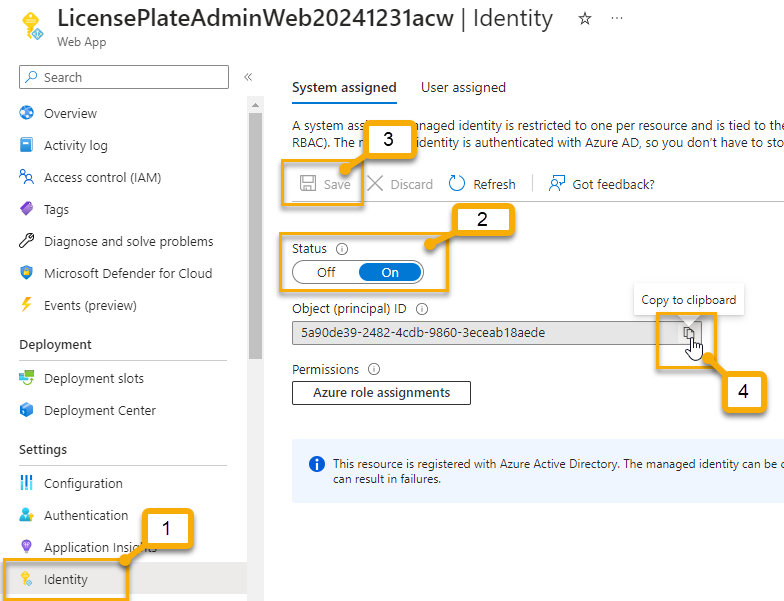

# Create the Web Admin System and Database

In this challenge you will create the Azure SQL Database and the Web Administration system. You will wire up the web solution and make sure everything works with the Azure Database.

This walkthrough builds the region of the diagram below labelled with `7`:

  

## Task 1 - Create the Simulated legacy database  

For part of this solution, you will port data into an Azure SQL database to simulate the legacy ticketing system.  Once license plates are verified, you will push the data into this system.  In this first task you will create the "legacy" database as a basic SQL Database at Azure.

1. Start the process to create a basic SQL Database at Azure

    Navigate to the Azure portal and search for `Azure SQL`.  On the blade for Azure SQL, select `+ Create` or `Create Azure SQL resource.`  

      

    Choose `SQL Databases` and select `Single database` as the resource type.  Hit the `Create` button.

    

    On the Create blade, select your subscription and resource group.

    For the database name, enter something like:

    ```text
    LicensePlateDataDb
    ```  

    And then you will need to select `Create new` for the server to open the create new server blade.  

      

    The servername must be unique with only small chars, hyphens, and numbers, so enter something like:

    ```text
    license-plate-db-server-YYYYMMDDxyz
    ```  

    For the location, choose your region of choice that you've been using all along.  

    Select `Use SQL Authentication` [the default] for the authentication method, and enter a username and password combination.

    Note the rules for password

    - Minimum 8 characters
    - Maximum 128 characters
    - Three types of characters
    - no login info in the password

    I suggest creating a user such as:

    ```text
    serverlessuser
    ```  

    And then using a password that meets the criteria that you will remember (or keep it handy, as you will need it in the rest of this workshop).  

      

    Hit the `OK` button.

    This will take you back to the main form.

    on the main form, change the `Compute + Storage` by hitting the `Configure database` link:

      

    >**Note:** Recent updates allow you to make the load production or development.  Switch to `development` for this workshop, then select the basic workload.

    Change to basic to save a ton of money.  You won't need more than basic for this solution.  It will cost $5/month at all storage levels, so just leave it to 2GB.

      

    Change the backup to Locally-redundant.  You won't need Geo redundancy or read-only copies for this workshop.

      

    Hit the `Next: Networking` button.

1. Set the Networking

    The networking sets your ability to connect from your local IP and for other azure services to connect.

    For the `Network Connectivity`, select `public endpoint`.  

    On the firewall rules, select `YES` for services (allows appservice and function apps to connect) and your current client IP address (allows you to connect from SSMS from your local machine)

      

    Leave other settings to default.

    Hit the `Next:Security` button.

1. Security Review

    Ordinarily you'd want to turn on defender.  You could also add an identity to allow RBAC identity for this server.

    For this activity, you don't need to make any changes on this tab.

    Hit `Next: Additional Settings`

1. Additional Settings

    No changes here either, but you can load a backup or a sample database here if you wanted for future projects.  YOu can also set collation and maintenance windows (although there is no other option for the window).  

    Hit `Review + Create`

1. Review + Create

    Validate and Create your database

    Ensure the price, networking, and everything else is correct.

      

1. Get your database connection string

    Once the database is created, navigate to the resource and get the connection string.

    You will need to put your password in the connection string.

      

    Copy and paste to a notepad or code file and replace `{your password}` with the password you used previously.  Keep it handy, you'll likely need it a couple more times in this workshop.

    Add the connection string to your KeyVault named something like:

    ```text
    LicensePlateDataDbConnection
    ```

      

    >**Note:** during review you might notice the wrapping on the hyphen.  You can use the arrow key to validate it is all there or you can just copy/paste to notepad to validate it is there.

    Copy and paste the URI for the Secret to notepad, and remove the version number. Feel free to wrap it with:

    ```text
    @Microsoft.KeyVault(SecretUri=https://your-vault-name-here.vault.azure.net/secrets/LicensePlateDataDbConnection)
    ```  

    Something like:

    ```text
    @Microsoft.KeyVault(SecretUri=https://workshopvault20231231blg.vault.azure.net/secrets/LicensePlateDataDbConnection)
    ```  

1. Get the starter project

    For the last parts of this workshop, you'll need a web application that has the ability to interact with the legacy data and you'll add the ability to interact with the service bus as part of the final challenge.

    First, [download the starter project](https://github.com/AzureCloudWorkshops/ACW-ServerlessArchitecture/blob/main/SourceFiles/LicensePlateAdminSystem-v0.7.0.zip), then create a new private repository to house the project.  

      

    Extract the files to a reasonable place (likely in the same folder that you created the functions app earlier)  

      

    Create a local repository for the downloaded files, Then add and commit initial commit for the local repo

    ```bash
    git init
    git add .
    git commit -m "Initial Commit"
    ```  

    

    

    Create a new repository:

      

    Leave it private and don't initialize anything in it.  

    Add the remote repository and push (the code should be on your new repository page)  

      

    The commands you need to run are:

    ```bash
    git remote add origin <your-repo-link-here>
    git push -u origin main
    ```  

      

    And after pushing, you should refresh the repo and see the code:

      


    >**Note:** Keep track of where you put this because you'll be modifying this code in the final challenge for our workshop.

## Task 2 - Deploy a new Azure web App

For this next task, you will deploy the web application in order to also provision the database.  Although it's likely not the best practice, the web application code is provisioned in a way that will automatically run migrations when the app is started.  
    
Without the database set up correctly, this will cause the application to break until the database connection strings are correctly wired up and migrations are applied. 
    
Another side-effect of this approach is the fact that the migrations will only be able to roll forward, as building to target a migration will automatically apply any migrations, so you won't ever be able to remove a migration once it has been created.  
    
These "gotchas" will not affect our project as we likely don't need any database changes or migration work, and having the automatic application would make any future changes easier.

1. Start the process to create the web application at Azure

    To get started, you will create a free app service web app at Azure.  Navigate to the portal and search for `App Service`.  On the `App Service` blade, click `+ Create`

      

    Select your subscription and resource group.

    Name the application something like:

    ```text
    LicensePlateAdminWebYYYYMMDDxyz
    ```  

    For the `Publish` select `Code`

    For the `Runtime Stack` choose `.Net 6 (LTS)`  

    Select the region you've been using for other deployments.  

      

    For the windows plan, select the default new plan, or if there isn't a (New) in the name then use the `Create new` to create a new plan with a name, something like

    ```text
    ASP-RGServerlessWorkshopYYYYMMDDxyz
    ```  

    For the `Sku and size` select `Change size` and then select the `Dev/Test` option and then the `F1` Shared free tier, then hit `Apply`.

      

    Click `Next: Deployment`

1. Wire up the deployment from GitHub Actions

    On the `Deployment` tab, select `Enable` for `GitHub Actions Settings`

    Wire up your account, select the correct organization and then select the `LicensePlateAdministrationSystem` (or whatever you named yours) repository and `main` branch.  

      

    >**Note**: If for some reason you can't deploy via actions here, you can use the code for the ubuntu build and add your own action with your publish profile, or you can right-click and publish from your web app locally if all else fails

    Select the `Next: Networking >` button.

1. Networking

    You cannot change anything for networking on the free tier.

    Hit `Next: Monitoring >`

1. Monitoring

    On the monitoring tab, leave the Enable Application Insights set to `Yes` and the instance to a new instance.

      

    Hit the `Review + create` button.

1. Validate and create

    On the review blade, ensure you are in the free tier and that you are using code for .Net 6

    Once ready, hit the `Create` button.

      

    Wait for the deployment to complete, which will include the GitHub action.

    Navigate to your GitHub repo to see the action run.  Note that the default is a two-stage build and deploy action and that it leverages the windows agent by default.  Unfortunately, the two-stage deployment is overkill and ubuntu will once again perform better.

1. Set the connection string on the deployed app service

    Once the app service is deployed, you can update the connection string information.  For this application, there are **two** connection strings, but you should just point them at the same database for simplicity.  The first connection string is for `Identity` and the second is for `LicensePlateData`.

    If you review the `appsettings.json` file in the web application for the admin system, you will see the two connection strings called out:

    ```text
    IdentityDbConnection
    ```  

    and

    ```text
    LicensePlateDataDbConnection
    ```  

      

    You will need to put these both into your app service `Configuration` -> `Connection Strings` section.

    Return to your app service in the portal and select `Configuration`.  On the configuration, at the bottom in the `Connection Strings` section, create two connection strings with the names called out above and the value for each should be the value of the KeyVault Secret URI).  Set the type to `SQLAzure.`

      

    Ensure both are present, and don't forget to hit `Save`

      

1. Give the App Service an Identity 

    In order for the connection string to work, you'll need to give the application an identity.

    Under the `Identity` section, turn on `System Assigned Identity`, hit `save` and `confirm`. When done, copy the new Object (principal) ID to your clipboard for use in the next step at KeyVault.  

    

1. Authorize the Web App to Key Vault `Get` Secrets

    Go to the KeyVault for your solution and add a new access policy to allow the Web Application to `Get` Secrets using the Object ID from the previous step and the Get permission selection

    

    Restart the web app and refresh (it may take a couple of minutes).  Validate that the connections are working as expected.

      

1. Ensure the application works

    With the connection strings in place and the CI/CD working (fix any errors if you have any), you should have a deployment to the app service and the connection strings and everything should be set.

    The last thing you need to do to make sure the web application works is to ensure the migrations are applied.  If everything is set correctly in your connection strings, this should happen automatically.  You may need to restart the application for settings to take, especially if you have received an error.
    
    Navigate to the `overview` tab for your deployment, then hit the link for the public-facing URL to see your page up and running.  

      

    **If everything is working, you are done** with this step and you should **move on to Task 3**

    You will know it's working if you can navigate to the `Review Plates` nav item and see 10 plates that are already processed:

      

    Unfortunately, any small issue and you will likely get a 500.30 error.  This will happen if you have anything incorrect in the database connection strings, including the name of the connection strings or something as trivial as the password or a typo in the connection string.

      

    If this happens, double and triple check that you have saved your connection string information correctly with the correct password for both connection strings.

    If you are certain you have everything correct in the username and password for your connection strings at Azure, then you could open the project locally from your own machine, point the project connection strings at Azure and apply the two migrations.

    >**Note**: You only have to do this if the app doesn't work right away! If things are working, move on to `Task 3`

    Open the project locally, ensure it builds and then open the `Package Manager Console`
    
      

    Next, open the `appsettings.json` file in the `LicensePlateAdminSystem` project.  Change the Connection string values for the two connection strings to your Azure database connection string.

      

    Save the file, then change the run the following command in the package manager console:

    ```powershell
    update-database -context ApplicationDbContext
    ```  

      

    If you get an error, make sure that you have set things correctly (including the default project selection of `LicensePlateAdminSystem`) and double-check your connection string.  Also, if you didn't allow your own IP this won't work locally.

    Next, change the `Default Project` to the `LicensePlateDataLibrary` and run the following command:
    
    ```powershell
    update-database -context LicensePlateDataDbContext
    ```  

      

    You can then open the database in SSMS to see the changes:

      

    Additionally, you can see the data on the database blade in the portal:

      

    If you are still getting errors, try checking to make sure that you have set the server firewall on the database to allow the web application (any Azure Services) to connect to the database (you would also need to have this working for your IP if you tried to run migrations as above)

       


## Completed

You have now completed the bulk of the work for this solution.  The only thing that remains is working with the queue and storage from the web app to allow manual review of the images for further processing.

In this challenge you created and deployed the code for the Legacy web admin system.  You also created the backing Azure SQL database where the "ticketing" code needs to have processed plates.
