# Export parsing

In this challenge you will parse the exported CSV files based on data received from the previous challenge.  Based on the name of the file the correct function will have been triggered.

The function will review the body of the post to get the correct file from storage, will parse the CSV file, and will put the processed data into the legacy SQL ticketing system.

## Task 1 - Build the Storage Connection and File Parsing common logic  

For this task you will push all of the confirmed records into a simple table that stores the same information that was in the CSV File.  For our purposes, this is the final step to get data into the legacy system.  In the real world, you might also have to do things like look up the registration information and add that foreign key to the record.  

There are many ways you could go about getting the data into the database.  You could create a WebAPI and authorize a post to the endpoint with the records.  You could build an Azure Data Factory pipeline that moves the data from cosmos to SQL.  You could have someone manually review the file and enter it.  You could use an on-premises SSIS package with the file. As such, the solution here is but one option in a choice of many, and may not represent the best solution.

For this solution, however, you will just leverage the database library project and push directly to the application database that you created in the first task above.

In the previous challenge you already created the functions, now you just need to complete the work for the functions.

Both paths will utilize the same code to parse the incoming file.  The first task will be to be able to connect to the storage account via the key and be able to then get the appropriate file and then parse the file using the CSV parsing code.

The output will be a list of LicensePlates.  The application will then need to utilize the database library from the legacy system to push the list into the database.

The two paths are: 
- Process Reviewed/Ready for Import plates to the SQL Database
- Process Non-Reviewed/Ready for Review plates to Azure Service Bus

### Create the logic to get the file from storage  

To get started, first you will need to be able to get the file from storage.  From the logic app, you were already posting the filename as part of the request body and you already have the code to get the filename in the logic.  Your current functions should look something like this:

```c#
public static class ProcessImports
{
    [FunctionName("ProcessImports")]
    public static async Task<IActionResult> Run(
        [HttpTrigger(AuthorizationLevel.Function, "get", "post", Route = null)] HttpRequest req,
        ILogger log)
    {
        log.LogInformation("Process Imports started");

        string requestBody = await new StreamReader(req.Body).ReadToEndAsync();
        dynamic data = JsonConvert.DeserializeObject(requestBody);
        var fileUrl = data.fileUrl;
        log.LogInformation($"File url posted for processing: {fileUrl}");

        return new OkObjectResult("Processing Completed");
    }
}
```  

>**Reminder:** the filename is pulled from the request body as processed by the Logic App.

1. Get the values for the connection from the previously created environment variables.

    In a previous task, you exported files to this storage account using the code in the `ExportPlateData` function.  In that function, you retrieved the two important environment variables for working with storage:

    ```c#
    var container = Environment.GetEnvironmentVariable("datalakeexportscontainer");
    var storageConnection = Environment.GetEnvironmentVariable("datalakeexportsconnection");
    ```  

    You will need these two lines in each of the `ProcessImports` and `ProcessReviews` CSV parsing functions.  Add them now to both functions after getting the file url:

    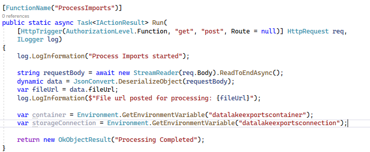  

    In the `BlobStorageHelper` you already have a method for `DownloadBlob`. 

    In each of the two csv parsing functions, add the following code to get the blob that was posted for use within the individual functions:

    ```c#
    var blobHelper = new BlobStorageHelper(storageConnection, container, log);
    var theBlob = await blobHelper.DownloadBlob(BlobStorageHelper.GetBlobNameFromURL((string)fileUrl, container));
    log.LogInformation($"Blob Data Retrieved with length: {theBlob.Length}");
    ```  

    >**Note:** This code relies on a new helper function to strip out the account and container info from the blob URL to get just the name of the blob for download.  You will write that next.

1. Add the static method to get the BlobName from the Blob url.

    Add the following static method to the BlobStorageHelper class in the StorageAndFileProcessing folder for the function app:

    ```c#
    public static string GetBlobNameFromURL(string fileUrl, string container)
    {
        var containerIndex = fileUrl.ToUpper().IndexOf(container.ToUpper());
        var nextSlash = fileUrl.IndexOf("/", containerIndex);
        return fileUrl.Substring(nextSlash);
    }
    ```  

1. Push changes, Get Postman, Get the blob storage urls, and get the function URLs

    Commit the changes and push so that the project will deploy to Azure.

    While the project is deploying, get PostMan on your machine if you don't have it already [https://www.postman.com/download](https://www.postman.com/download)  

    Since these functions are https triggered, and you can get the function key and information you need, you can easily trigger them via Postman for testing.

    First, go to the storage account and get the url for one of each type of file (if you don't have one of each type, then create one of each type from the initial processing already set up):

    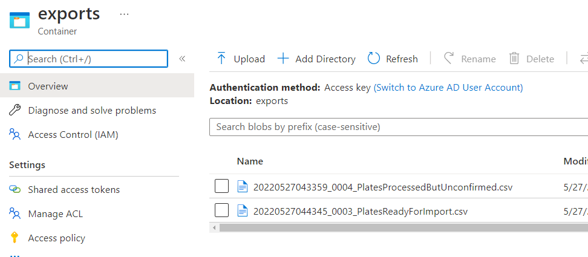  

    Drill in to each one for the URL and paste the url into notepad for easy retrieval.

      

    They should be something like this (obviously not exactly this):

    ```text
    https://datalakexprts20231231xyz.blob.core.windows.net/exports/20220527043359_0004_PlatesProcessedButUnconfirmed.csv
    https://datalakexprts20231231xyz.blob.core.windows.net/exports/20220527044345_0003_PlatesReadyForImport.csv
    ```  

    Ensure your function app deployed and open the function app to get the function URLs.  
    
    Get the url for `ProcessImports` and `ProcessReviews`.  
    
    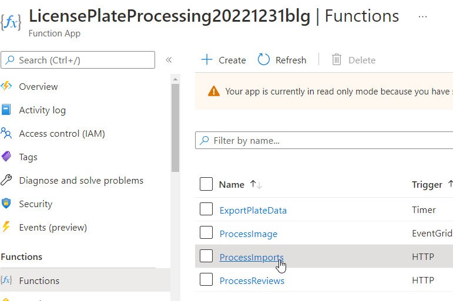  

    Also, make sure to get the function key so you can trigger the post for the function:

    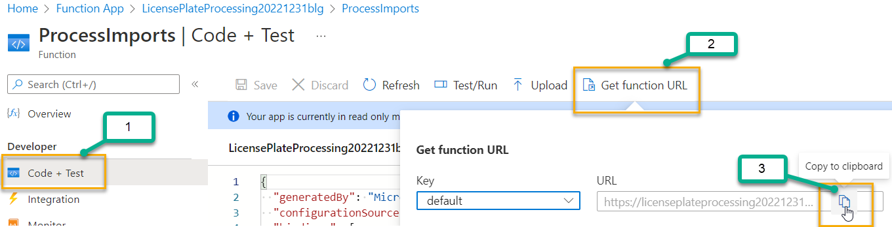  

    Also put these urls into your notepad.  They shoudl look something like this:

    ```text
    https://licenseplateprocessing20221231blg.azurewebsites.net/api/ProcessImports?code=mZ6gVdwQKD8ib8N474ZpYXXRiFeCz9HqKkz3pgyhAcsLAzFuGDoIkg==
    https://licenseplateprocessing20221231blg.azurewebsites.net/api/ProcessReviews?code=Nm1hlcmPeEfomwog7vukhXncckUXmknqW-TKpYvSUPKZAzFu556VJg==
    ```  

    Again your code and naming will be different.

1. Test the function via postman

    Open Postman.  Create a new query and switch it to Post to the process imports function:

      

    Select the `Body` tab, and then switch to `Raw`.  Put your JSON in to send the file URL for your imports file.  Something like this:

    ```json
    {
    "fileUrl":"https://datalakexprts20231231xyz.blob.core.windows.net/exports/20220527044345_0003_PlatesReadyForImport.csv"
    }
    ```  

      

    Make sure you have the function open in the browser and watch the monitor logs page to see the parsing.

      

    Hit the `Send` button from postman to send the request and trigger the function:

      

    Repeat for the other function and make sure to put the correct filename in for the reviews processing:

    Storage work is now completed.

### Create the logic to parse the CSV file

Now that you have the blob in memory, you need to parse it as a CSV and you need to then get that data into a list of object that you can store to the database or push information into the Service Bus Queue for further processing.

1. Rename the helper class in the `StorageAndFileProcessing` folder

    In the StorageAndProcessingFolder, rename the class `CreateSCVFromPlateDataInMemory` to `CSVHelper`.  Update all references.
    
    In the renamed class, add a new method as follows:

    ```c#
    public static List<LicensePlateData> GetPlateDataFromCSV(byte[] csvFileBytes)
    {
        var plateData = new List<LicensePlateData>();

        using (var ms = new MemoryStream(csvFileBytes))
        {
            using (var reader = new StreamReader(ms))
            {
                // Read file content.
                while (reader.Peek() != -1)
                {
                    var nextLineData = reader.ReadLine().Split(",");
                    if (nextLineData[0].Equals("filename", StringComparison.OrdinalIgnoreCase)) continue;
                    var lpd = new LicensePlateData();
                    lpd.FileName = nextLineData[0];
                    lpd.LicensePlateText = nextLineData[1];
                    lpd.TimeStamp = Convert.ToDateTime(nextLineData[2]);
                    plateData.Add(lpd);
                }
            }
        }
        return plateData;
    }
    ```  

    

1. Call the parsing function

    From each of the two processing methods, call to the function to get license plate data from the export file using the following additional code:

    ```cs
    //parse the plate information
    log.LogInformation($"Parsing file: {fileUrl}");
    var plateData = CSVHelper.GetPlateDataFromCSV(theBlob);

    log.LogInformation($"Plate Data Retrieved {plateData.Count} plates");

    foreach (var p in plateData)
    {
        log.LogInformation($"Plate: {p.LicensePlateText}");
    }
    ```  

1. Test each path to ensure parsing is working

    Return to postman and re-post the requests for each function to ensure parsing is working as expected.

    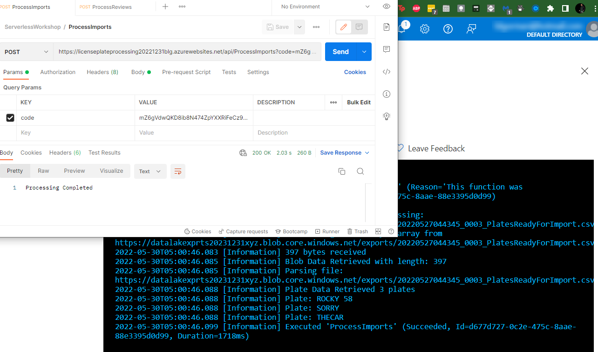  

## Task 4 - Process Confirmed Records to Azure SQL

Now that the processing function is ready to go, it's time to move the data.  For the Imports, there are two actions to complete.  

First, you need to get the data into SQL and second you need to update Cosmos, setting each record that was imported as finalized (completed and exported set to true).  This will prevent any further exporting or evaluation of these plates.

1. Get the database library set up

    To get the records into the database, you'll need to bring in the data library from the legacy web app.  Additionally, you'll need to add the two database connection strings to the Function app.

    Open the folder where you downloaded the legacy web application.  In that folder, copy the folder for the DataLibrary project (the one with the migrations and the database context).  Paste the project folder into the same folder where your function app root is located:  

    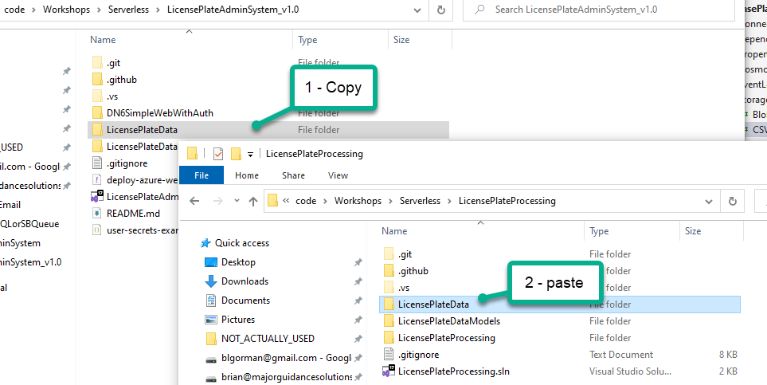

    Now there is a direct conflict.  The original project and your function project both have projects and folders called `LicensePlateDataModels`.  Additionally, the legacy project has the data so that has to be the winner in any conflicts.  Really, the models on the function app side are DTO objects to get data transferred and also interact with CosmosDb.  

    There are a number of potential fixes for this, but the best solution is probably just putting the LicensePlateData into the original library project and then referencing the file from that location going forward.  You could probably get away with just adding the library data model class `LicensePlate` into the existing data  models project since they have the same namespace and you just created both in the last few hours.  However, let's do this the hard way.

    Return to the AdminSystemWebApplication and ensure you pull the latest changes (to get the YAML files).  Additionally, ensure you don't have any appsettings.json changes (if you were manually updating migrations earlier).

    Add the existing object class for `LicensePlateData` to the DataModelsProject:

    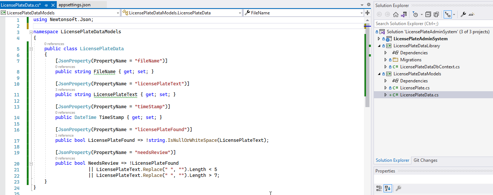  

    Copy and paste the code and bring in Newtonsoft.Json.

    Open the folders again for the function app and the admin web system.

    In the Function app, delete the current data models project, then copy and paste the library models project (the one with both data files).

      

    Since the project is named the same, the errors will go away as soon as you copy and paste the new library with your additional file that was in the original library.

    Build the project to ensure it succeeds.

1. Reference the Database code

    Right-click the solution and bring in the existing project for the DataLibraries
    
    Then, right-click the LicensePlateProcessing functions and add the project reference for the database.

    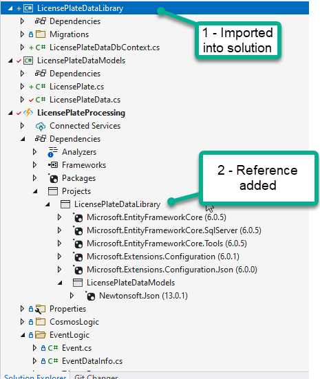  

1. Leverage the database code in the `Imports` function

    In order to use the database context in the function app, you will want to leverage dependency injection.  To do this, first you will need to bring in some NuGet libraries:

    ```text
    Microsoft.Azure.Functions.Extensions
    ```  

    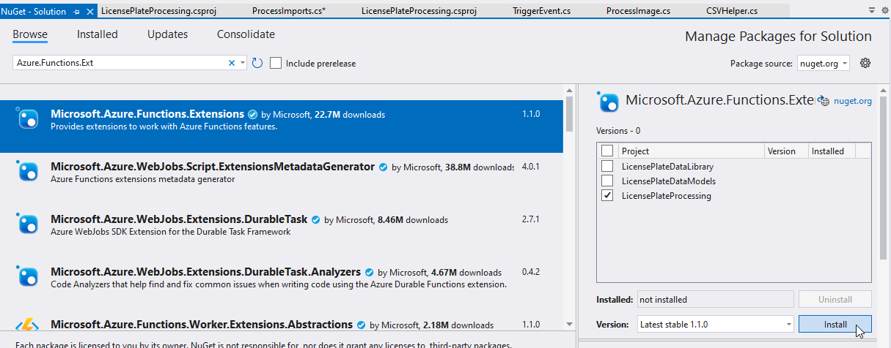

    and

    ```text
    Microsoft.Extensions.DependencyInjection
    ```  

      

    Once these are in place, create a new class in the project called `Startup.cs` and add the following code to the class [reference here](https://docs.microsoft.com/en-us/azure/azure-functions/functions-dotnet-dependency-injection#register-services)  

    ```cs
    using LicensePlateDataLibrary;
    using Microsoft.Azure.Functions.Extensions.DependencyInjection;
    using Microsoft.EntityFrameworkCore;
    using Microsoft.Extensions.DependencyInjection;
    using System;

    [assembly: FunctionsStartup(typeof(LicensePlateProcessing.Startup))]

    namespace LicensePlateProcessing
    {
        public class Startup : FunctionsStartup
        {
            public override void Configure(IFunctionsHostBuilder builder)
            {
                //NOTE: Environment Variables come from Application Settings, not connection strings!
                string connectionString = Environment.GetEnvironmentVariable("LicensePlateDataDbConnection");
                builder.Services.AddDbContext<LicensePlateDataDbContext>(
                options => SqlServerDbContextOptionsExtensions.UseSqlServer(options, connectionString));
            }
        }
    }
    ```  

    Additionally, add the connection string to your `local.settings.json` file if you want to test locally (requires that you've migrated the database as expected locally):

    ```json
    {
        "IsEncrypted": false,
        "Values": {
            "AzureWebJobsStorage": "UseDevelopmentStorage=true",
            "FUNCTIONS_WORKER_RUNTIME": "dotnet",
            "LicensePlateDataDbConnection": "Server=tcp:license-plate-db-server-20231231blg.database.windows.net,1433;Initial Catalog=LicensePlateDataDb;Persist Security Info=False;User ID=serverlessuser;Password=.....;MultipleActiveResultSets=False;Encrypt=True;TrustServerCertificate=False;Connection Timeout=30;"
        }
    }
    ```

1. Inject and use the context in your ProcessImports function

    With the injection ready to go, change the ProcessImports function to no longer be static, then add a variable for the database context, and a constructor to inject it. Also, remove the static attribute from the Run method:

    ```cs
    public class ProcessImports
    {
        private readonly LicensePlateDataDbContext _context;

        public ProcessImports(LicensePlateDataDbContext dbContext)
        {
            _context = dbContext;
        }

        [FunctionName("ProcessImports")]
        public async Task<IActionResult> Run(
            [HttpTrigger(AuthorizationLevel.Function, "get", "post", Route = null)] HttpRequest req,
            ILogger log)
        {
            log.LogInformation("Process Imports started");
    ```

    Add the following at the top of the method to validate context injection is working:

    ```cs
    var test = await _context.LicensePlates.ToListAsync();
    foreach (var t in test)
    {
        log.LogInformation($"Plate: {t.LicensePlateText}");
    }
    ```

    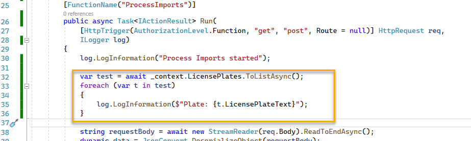    

1. Get the connection string to KeyVault in the application settings.

    Make sure to add the connection string to your Azure Function as an application setting, not a connection string:

    

    >**Note:** Don't forget to save!

    Make sure the checkmark for the KeyVault reference turns green

      

    Push the changes and test.

    


1. Push all the new plates into the database

    Now that the database is wired up, you can easily push the new ones into the database.

    First, remove the test logic that proved the database is working.

    After the plate data is parsed, change the for loop to "map" the data from the `LicensePlateData` to `LicensePlate`.  First add a new list of LicensePlate and then map each one.  After mapping, save the changes.

    ```cs
    var plates = new List<LicensePlate>();
    foreach (var p in plateData)
    {
        log.LogInformation($"Import Plate: {p.LicensePlateText}");
        var plate = new LicensePlate();
        plate.FileName = p.FileName;
        plate.TimeStamp = p.TimeStamp;
        plate.LicensePlateText = p.LicensePlateText;
        plate.IsProcessed = false;
        plates.Add(plate);
    }

    log.LogInformation("Importing all plates to database and saving changes");
    _context.LicensePlates.AddRange(plates);
    await _context.SaveChangesAsync();

    log.LogInformation("Plates imported successfully");
    ```  

    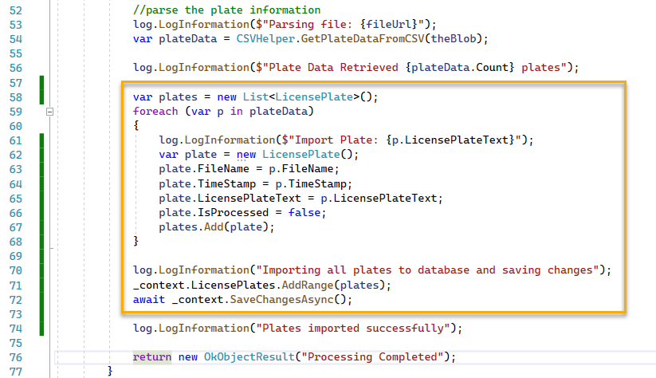   

1. Push changes and test the import.

    Run the import and then review in the admin system.
    
      

    And the records are in the system:

      

    >**Note:** IsProcessed here indicates a ticket has been issued by the system, not anything with our serverless system.

## Task 5 - Process Unconfirmed Records to Service Bus

For this task, you will push all of the records that are ready for review into the Azure Service Bus Queue so that the team can perform the required manual review on them to validate the results.

If time permits, consider also putting this into a feature flag toggle, where you can easily turn it off once the team is satisfied that the vision system is processing as expected.  In that case, you would still want to 

1. Get the connection information for service bus

    In the portal, navigate to your service bus instance.  For this work, you just need to be able to publish to the service bus, you do not need to read.

    On the service bus blade, navigate to your service bus, then open the queue and navigate to your queue.  Note the name of your service bus queue.

      

    In the queue, select `Shared access policies` then `+ Add`

    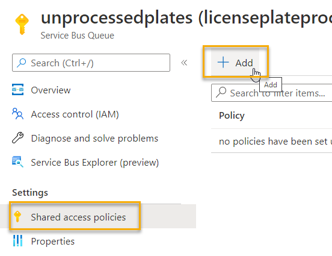  

    On the right-hand side, create a policy named `writetoqueue` and check the `Send` button

    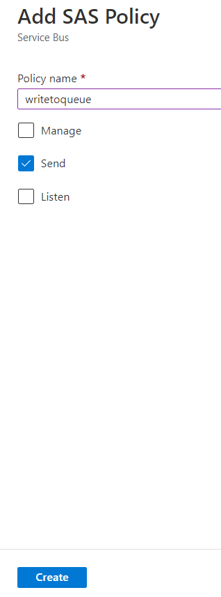  

    Hit `Create`.  When completed, drill into the policy and get the info for `Primary Connection String`

    >**Important**: You will need this connection string and the name of your service bus queue in the next tasks.  

1. Add the SAS connection string for the queue to KeyVault

    Navigate to your key vault and add a new secret for `WriteOnlyUnprocessedPlatesQueue`.  Put the value from the policy just generated from the connection string into the KeyVault Secret.

    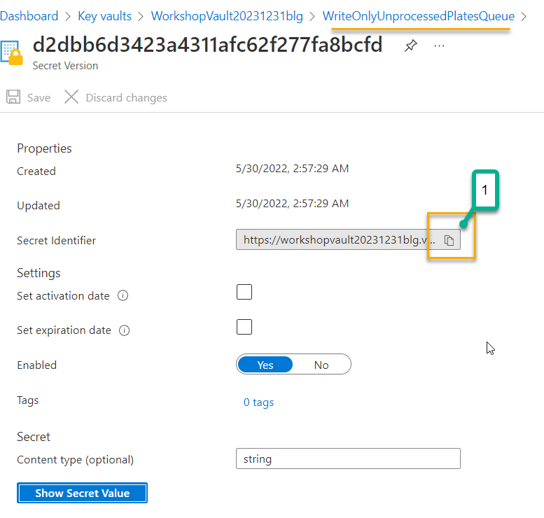  

    Get the value of the URI for the secret for use in the app settings of the function app.  Wrap it as you've done for many keys before to indicate it's a Microsoft.KeyVault reference.

1. Add the connection information to the application settings

    To get started, 

    In configuration, under App Settings, add a new application setting.  Name the setting

    ```text
    WriteOnlySBConnectionString
    ```  

    Put the value as the wrapped KeyVault secret URI:

    ```text
    @Microsoft.KeyVault(SecretUri=https....)
    ```  

      

    Save and ensure the green check mark is applied.  

    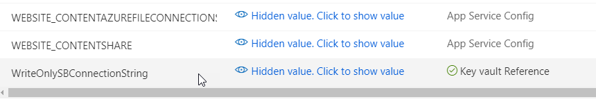  

    Add another application setting for the queue name:
    
    ```text
    ServiceBusQueueName
    ```  

    Put the name of the queue in that value (such as `unprocessedplates`)  

1. Establish the Service Bus code

    To complete this challenge, you just need to push the plates that came in for review to the service bus for manual processing from the web application.  

    In previous examples you used bindings.  In this example, you will use code to directly connect to the service bus and write messages.

    Replace the `foreach (var p in plateData)` code block by wrapping it with the following code:

    ```cs
    //add the service bus connection and clients
    var sbConnectionString = Environment.GetEnvironmentVariable("WriteOnlySBConnectionString");
    var sbQueueName = Environment.GetEnvironmentVariable("ServiceBusQueueName");
    var client =  new ServiceBusClient(sbConnectionString);
    var sender =  client.CreateSender(sbQueueName);

    >**Note**: You will need to bring in the NuGet Package for `Azure.Messaging.ServiceBus`

    // create a batch
    using ServiceBusMessageBatch messageBatch = await _sender.CreateMessageBatchAsync();
    {
        try
        {
            foreach (var p in plateData)
            {
                log.LogInformation($"Plate: {p.LicensePlateText}");
            }
        }
        catch (Exception ex)
        {
            //consider logging something more verbose to application insights
            log.LogError($"{ex.Message}");
        }

        try
        {
            //update with send code in next step
        }
        catch (Exception ex)
        {
            //consider logging something more verbose to application insights
            log.LogError($"Exception sending messages as batch: {ex.Message}");
        }
        finally
        {
            //clean up resources
            await sender.DisposeAsync();
            await client.DisposeAsync();
        }
    }
    ```

    >**Note:** This code puts the original for each loop into the `try` block, and establishes the client and sender for the ServiceBus Queue in code.  

1. Compose and send the Queue message

    Replace the `foreach (var p in plateData) code with the following code block to batch the messages for sending to the queue:

    ```cs
    foreach (var p in plateData)
    {
        log.LogInformation($"Plate: {p.LicensePlateText}");

        StringBuilder sb = new StringBuilder();
        sb.Append("{");
        sb.Append("\"fileName\":\"");
        sb.Append(p.FileName);
        sb.Append("\",\"licensePlateText\":\"");
        sb.Append(p.LicensePlateText);
        sb.Append("\",\"timeStamp\":\"");
        sb.Append(p.TimeStamp.ToString());
        sb.Append("\",\"exported\": false");
        sb.Append("}");

        var msg = sb.ToString();

        if (!messageBatch.TryAddMessage(new ServiceBusMessage(msg)))
        {
            // if an exception occurs
            throw new Exception($"Exception has occurred adding message {msg} to batch.");
        }
    }
    ```  

    Then add the following code to replace the comment `//update with send code in next step`:  

    ```cs
    await sender.SendMessagesAsync(messageBatch);
    log.LogInformation($"Batch processed {messageBatch.Count} messages to the queue for manual plate review");
    ```  

1. Check in changes and test using PostMan against the Process Reviews function

    Wait for the changes to deploy, then use your PostMan instance to trigger the Reviews function with the file Url for the review file data.

    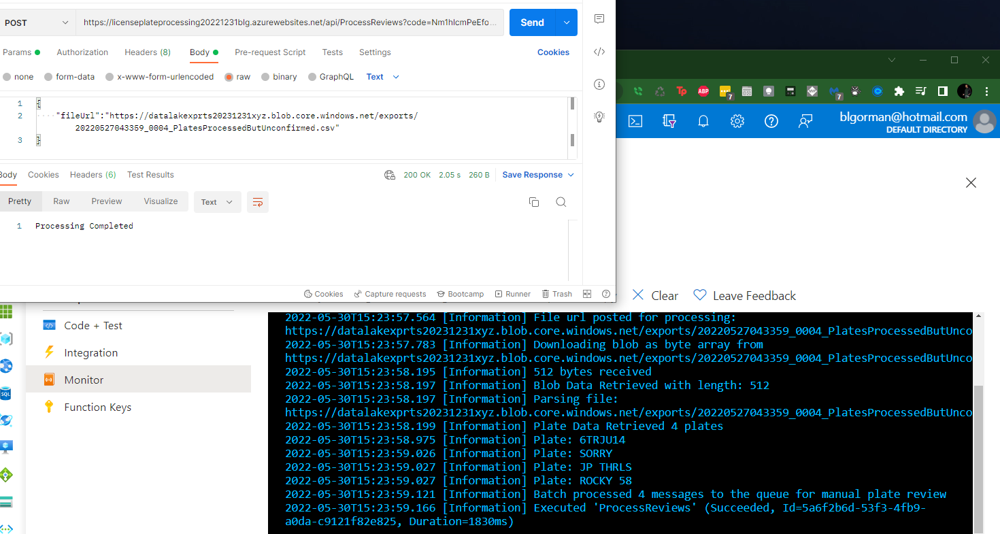  

1. Review the queue to see your messages

    Open the queue to see your messages were placed into the queue:

    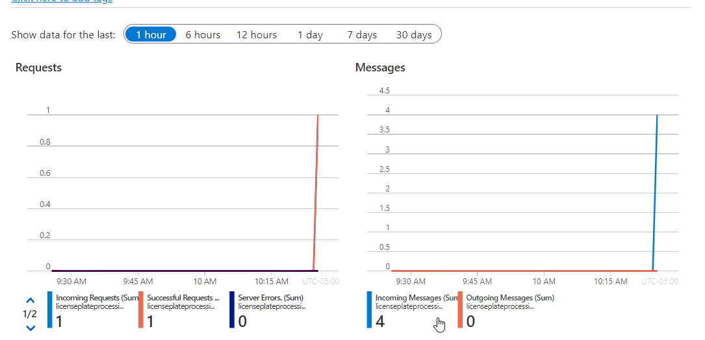  

    You can also open the Service Bus Explorer to see the messages

      


    You modified the two functions that were being used for processing files to either push import data to the SQL Server or push information about files that need to be reviewed into the service bus queue.  