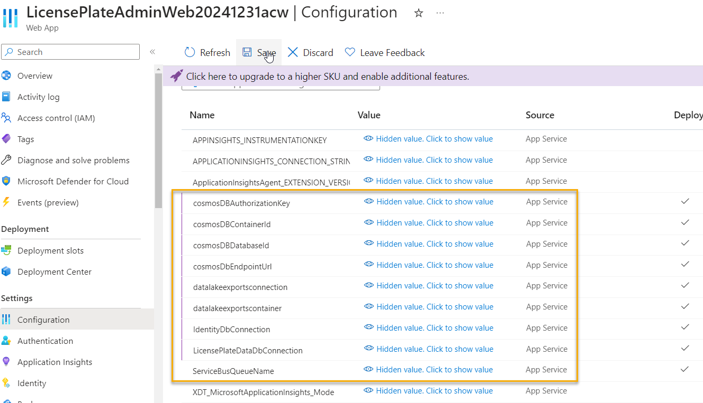
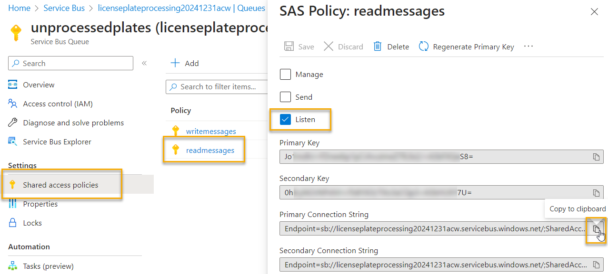

# Interact with the data 

In this challenge, you will complete the work by leveraging your .NET MVC Web application that will interact with the Service Bus to allow users to review and approve the license plates (updating the plate as necessary).  Additionally, your work will cause the reviewed plates to go back into the state where they will be exported for import.

The image is now completed, but section 9 really deals with getting the user interaction complete, retrieving items from the Queue and sending it back through Cosmos for final export.  

  

## Task 1 - Get the connection information

In the last challenge you created and deployed the web application.  In order to complete this challenge you'll need the cosmos db information, service bus connection information, and the storage account connection information.

1. Get the Cosmos, Service Bus and Storage Account connection information

    You already have a number of settings in the KeyVault, so you can just copy the settings from the function app and place them in the app settings for this project, but you will need a new service bus sas token to be able to listen and remove items from the queue (you'll get that next).

    >*Note:** You should have set the App Service to work with the KeyVault in step 7.  If you didn't do that, you will need to do so at this point.

    The items you need are:

    - ServiceBusQueueName
    - cosmosDBAuthorizationKey
    - cosmosDBContainerId
    - cosmosDbDatabaseId
    - cosmosDbEndpointUrl
    - datalakeexportsconnection
    - datalakeexportscontainer
    - IdentityDbConnection
    - LicensePlateDataDbConnection

    Copy the first settings from the function app (the storage container name may not exist on the other app), the only one you shouldn't have is the `ListenOnlySBConnectionString`

       

    >**Additional Note:** It is much easier to open the `Advanced Edit` option on both applications side-by-side and then just copy and paste the JSON that you need in the App Service from the Function App

      

1. Create the Service Bus SAS token for `Listen`

    Leave your KeyVault blade open or get it open if you don't already have it open.

    In another tab, open your service bus queue.  Navigate to the queue for unprocessed plates, and then select the Shared Access policies and then hit the `+ Add` to add a new policy:

      

    Name the policy something like:

    ```text
    readmessages
    ```  

    And select the `Listen` option

      

    Hit the `Create` button.

    Open the created SAS, and then copy the `Primary connection string` value

      

    Return to the KeyVault blade and add a new secret called

    ```text
    ReadOnlyUnprocessedPlatesQueueConnection
    ```

    Add the value and then save it, then validate the value saved and get the URI

      

    Wrap the URI with the @Microsoft.KeyVault(SecretUri=....) replacing `...` with your uri, and removing the version from the end of the secret.

    ```text
    @Microsoft.KeyVault(SecretUri=....)
    ```  

    Something like:

    ```text
    @Microsoft.KeyVault(SecretUri=https://workshopvault20231231blg.vault.azure.net/secrets/ReadOnlyUnprocessedPlatesQueueConnection)
    ```  

    Return to the app service `Configuration` and then `New application setting`

    Name the setting:

    ```text
    ReadOnlySBConnectionString
    ```  

    Then add the value for the wrapped KeyVault URI

      

    Add and then Save, then refresh your settings.  

1. Finally, you need the storage account SAS token for the images container

    An easy way to get to private messages that are on a public endpoint is via a SAS token.

    Navigate to the plate images storage account.

    On the images container, select `Shared Access Tokens`

    - Signing Method: `Account key`
    - Signing Key: `Key 1`
    - Stored Access policy: `None`
    - Permissions: `Read`
    - Start time and Expiry time:  Change start time to yesterday, Change the expiration date to 1 year from today.

      

    Leave the remaining settings, then hit the `Generate SAS token and URL`

    This is the only time you'll see the key!  Copy it to clipboard, and then create a KeyVault setting for this SAS token  

      

    Return to the KeyVault and add the secret for 

    ```text
    ImageStorageSASToken
    ```  

    

    Validate your secret is set correctly, then grab the URI

    Wrap the URI in the typical

    ```text
    @Microsoft.KeyVault(SecretUri=...)
    ```  

    Then create an app setting to map for this SAS Token.

    Name the token 

    ```text
    PlateImagesSASToken
    ```

    Add the uri value that is wrapped as expected.

    Add, then save.  Wait a minute, then hit `Refresh`

    All the settings should be present now with the Key Vault Reference working as expected:

      

## Task 2 - Wire up ability to show plate images for selected plates

In this task, you'll add images to the pages for review of plates in the admin system.

1. Get the Image URL and SAS into the View data

    In the LicensePlateAdminSystem, select the `LicensePlateController`

    To complete this activity, you'll just inject image information into the ViewBag (if time permits feel free to create a ViewModel).  

    On the start of the code, add the SAS token as a global variable that is readonly and set in the constructor:

    ```cs  
    private readonly LicensePlateDataDbContext _context;
    private readonly string _SASToken;

    public LicensePlatesController(LicensePlateDataDbContext context)
    {
        _context = context;
        _SASToken = Environment.GetEnvironmentVariable("PlateImagesSASToken") ?? string.Empty;
    }
    ```  

    On the Details method, add the following line of code right before the line `return View(licensePlate)`

    ```cs
    ViewBag.ImageURL = $"{licensePlate.FileName}?{_SASToken}";
    ```  

1. Show the image on the details page

    On the `Views -> Details.cshtml` file, replace the default code to display the plate under the `<h1>Details</h1>` with the following (make sure to leave the actions in place!):

    ```html
    <div class="row">
        <div class="col-md-6">
            <div>
                <h4>LicensePlateData</h4>
                <hr />
                <dl class="row">
                    <dt class = "col-md-3">
                        @Html.DisplayNameFor(model => model.IsProcessed)
                    </dt>
                    <dd class = "col-md-9">
                        @Html.DisplayFor(model => model.IsProcessed)
                    </dd>
                    <dt class = "col-md-3">
                        @Html.DisplayNameFor(model => model.FileName)
                    </dt>
                    <dd class = "col-md-9">
                        @Html.DisplayFor(model => model.FileName)
                    </dd>
                    <dt class = "col-md-3">
                        @Html.DisplayNameFor(model => model.LicensePlateText)
                    </dt>
                    <dd class = "col-md-9">
                        @Html.DisplayFor(model => model.LicensePlateText)
                    </dd>
                    <dt class = "col-md-3">
                        @Html.DisplayNameFor(model => model.TimeStamp)
                    </dt>
                    <dd class = "col-md-9">
                        @Html.DisplayFor(model => model.TimeStamp)
                    </dd>
                </dl>
            </div>
        </div>
        <div class="col-md-6">
            
        </div>
    </div>
    ```  

    To test this locally, you'd have to set all your environment variables.  Let's deploy and see it working in the web to save some time.  If you have time, feel free to add your local settings for all of the information (if you want to reference Key Vault this is not trivial).  

    You can run it locally, but you won't see the image (if you want to inject the sas token manually you could also do that for testing).  You would also need to process some real image data into your table.  Again, not trivial, but easy enough if you're highly motivated.

    Push your changes, the review one of the processed plates from your testing:

      

## Task 3 - Get plates from the queue in the admin system for review.

To complete this task, you will need another page that shows data from the queue (this is NOT the processed data in the database, remember, but rather images that vision failed to identify with confidence and images for confirmation).

>**Important**: I'm sure we are out of time at this point.  For this reason, we're not going to handle the scenario where a plate gets pulled from the queue and then the user fails to process it in a timely manner.  In that case, we'd want it back in the queue.  For our purposes, we will pull it and never return it, even if processing fails in the interest of saving time.

1. Create the controller code to get the data for the next image from the queue.

    In the `LicensePlatesController` add the following code to the top of the controller:

    ```cs
    private readonly LicensePlateDataDbContext _context;
    private readonly string _SASToken;
    private static string _queueConnectionString;
    private static string _queueName;
    private readonly TelemetryClient _telemetryClient;
    private static int MAX_WAIT_TIME_SECONDS = 20;

    public LicensePlatesController(LicensePlateDataDbContext context, TelemetryClient client)
    {
        _context = context;
        _SASToken = Environment.GetEnvironmentVariable("PlateImagesSASToken") ?? string.Empty;
        _queueConnectionString = Environment.GetEnvironmentVariable("ReadOnlySBConnectionString") ?? string.Empty;
        _queueName = Environment.GetEnvironmentVariable("ServiceBusQueueName") ?? string.Empty;
        _telemetryClient = client;
    }
    ```  

    At the top of the file, add the following using statements:

    ```cs
    using Microsoft.AspNetCore.Mvc;
    using Microsoft.EntityFrameworkCore;
    using LicensePlateModels;
    using LicensePlateDataAccess;
    using System.Text;
    using Newtonsoft.Json;
    ```  

    Ignore the fact that some may not be needed yet.  

1. Create a new DTO to respond to the queue message

    In the Models folder for the web project, add a new class

    ```text
    LicensePlateQueueMessageData.cs
    ```  

    Put the following code in the new class file:

    ```cs
    using Newtonsoft.Json;

    namespace MakeSureToReplaceThisWithYourNamespace
    {
        public class LicensePlateQueueMessageData
        {
            [JsonProperty(PropertyName = "fileName")]
            public string FileName { get; set; }

            [JsonProperty(PropertyName = "licensePlateText")]
            public string LicensePlateText { get; set; }

            [JsonProperty(PropertyName = "timeStamp")]
            public DateTime TimeStamp { get; set; }

            [JsonProperty(PropertyName = "exported")]
            public bool Exported { get; set; }
        }

    }
    ```  

1. Create a new method in the controller
    
    Create a method to process the next image from the queue and display it to the user:

    ```cs
    // GET: LicensePlates/ReviewNextPlateFromQueue
    public async Task<IActionResult> ReviewNextPlateFromQueue()
    {
        var messageBody = string.Empty;
        var lpd = new LicensePlateQueueMessageData();
        try
        {
            if (string.IsNullOrWhiteSpace(_queueConnectionString) || string.IsNullOrWhiteSpace(_queueName))
            {
                throw new ArgumentException("Ensure queue readonly/consumer connection string and queue name are set correctly" +
                    "in the environment variables and/or key vault.");
            }

            //create the QueueClient to query for just one message at a time:
            var queueClient = new ServiceBusClient(_queueConnectionString);
            var options = new ServiceBusReceiverOptions() { 
                PrefetchCount = 0,
                ReceiveMode = ServiceBusReceiveMode.ReceiveAndDelete
            };
            var receiver = queueClient.CreateReceiver(_queueName, options);

            var waitTime = TimeSpan.FromSeconds(MAX_WAIT_TIME_SECONDS);
            var msg = await receiver.ReceiveMessageAsync(waitTime);

            if (msg is null || msg?.Body is null)
            {
                Console.WriteLine("No messages in the queue and wait time has elapsed");
                return RedirectToAction(nameof(Index));
            }

            string body = msg.Body.ToString();
            Console.WriteLine($"Received: {body}");

            var plateData = JsonConvert.DeserializeObject<LicensePlateQueueMessageData>(body);

            if (string.IsNullOrWhiteSpace(plateData?.FileName))
            {
                _telemetryClient.TrackException(new Exception("No data returned from the queue for processing"));
                return RedirectToAction(nameof(Index));
            }
            //inject the sas token on the url
            var imageURL = $"{plateData?.FileName}?{_SASToken}";
            _telemetryClient.TrackTrace($"ImageURL: {imageURL}");

            //add the image url to the viewbag for display
            ViewBag.ImageURL = imageURL;

            //open the review page with the LicensePlateData
            return View(plateData);
        }
        catch (Exception ex)
        {
            _telemetryClient.TrackException(ex);
            return Problem(ex.Message);
        }
    }

    ```

    Adding this code will require the `Azure.Messaging.ServiceBus` NuGetPackage.

      

    Ensure the code builds.

1. Add the view to handle the queue data

    In the LicensePlates -> Views folder, add a new view file:

    ```text
    ReviewNextPlateFromQueue.cshtml
    ```

    Select `Add New Razor View` for Details, and then select `Empty`

    Replace the `html` with the following:

    ```html
    @model LicensePlateQueueMessageData

    @{
        ViewData["Title"] = "Review Plate";
    }

    <h1>Next Plate: @Model.LicensePlateText</h1>

    <form asp-action="UpdateCosmos">
        <div class="row">
            <div class="col-md-6">
            <dl class="row">
                <dt class="col-md-3">@Html.DisplayNameFor(model => model.LicensePlateText)</dt>
                <dd class="col-md-9">@Html.EditorFor(model => model.LicensePlateText)</dd>
                <dt class="col-md-3">@Html.DisplayNameFor(model => model.FileName)</dt>
                <dd class="col-md-9" style="word-wrap: break-word;">@Html.DisplayFor(model => model.FileName)</dd>
                <dt class="col-md-3">@Html.DisplayNameFor(model => model.TimeStamp)</dt>
                <dd class="col-md-9" style="word-wrap: break-word;">@Html.DisplayFor(model => model.TimeStamp)</dd>
            </dl>
        </div>
            <div class="col-md-6">
                
            </div>
        </div>
        <div class="row">
            <div class="col-md-4">
                @Html.HiddenFor(model => model.FileName)  
                <input type="submit" value="Confirm Plate" class="btn btn-danger" />
            </div>
        </div>
    </form>
    ```  

    Then go back to the controller and add another method:

    ```cs
    // POST: LicensePlates/UpdateCosmos/lpd object
    [HttpPost, ActionName("UpdateCosmos")]
    [ValidateAntiForgeryToken]
    public async Task<IActionResult> UpdateCosmos([Bind("FileName,LicensePlateText,TimeStamp")] LicensePlateQueueMessageData licensePlateData)
    {
        var plateData = new Dictionary<string, string>();
        plateData.Add(licensePlateData.FileName, licensePlateData.LicensePlateText);
        _telemetryClient.TrackEvent("User updating plate", plateData);

        //TODO: Save to Cosmos

        return RedirectToAction(nameof(Index));
    }
    ```  

1. Add a navigation item

    Finally, add a navigation item for the new method in the `Layout.cshtml` file under `Shared` under `Views`

    ```html
    <li  class="nav-item">
        <a class="nav-link text-dark" asp-area="" asp-controller="LicensePlates" asp-action="ReviewNextPlateFromQueue">Review a Plate</a>
    </li>
    ```

1. Test your changes

    Publish and review at Azure.

    There are a LOT of moving pieces so far.  It's good to ensure the solution is working at Azure.  Commit and push your changes, then review on your public site:

      

    Assuming it is working, move to task 4.

    If not, remember that there is a bunch of telemetry in place.  Check the application insights for more error information:

      

## Task 4 - Update Cosmos DB to confirm the plate data

Here you need to get to the page and then post the updated text to Cosmos, along with the ability to mark the plate as NOT exported but Confirmed so that it will be exported to the finalized files.

1. Create and use a cosmos helper

    You already have similar code.  Go back to the function app and grab the cosmos helper class and the `LicensePlateDataDocument` class and paste them into your web solution in a folder called `Helpers`:

      

    Bring in the cosmos library.

1. Rename the file and delete the original two methods.

    Since this is copy/paste and will have breaking changes, rename the file to

    ```text
    CosmosOperationsWeb.cs
    ```  

    Next, delete the two existing methods. Your code will do everything in one method.

    Next, remove the `Logger` from the project and ensure TelemetryClient is added

    ```cs
    private readonly string _endpointUrl;
    private readonly string _authorizationKey;
    private readonly string _databaseId;
    private readonly string _containerId;
    private static CosmosClient _client;
    private readonly TelemetryClient _telemetryClient;

    public CosmosOperationsWeb(string endpointURL, string authorizationKey, string databaseId, string containerId, TelemetryClient telemetryClient)
    {
        _endpointUrl = endpointURL;
        _authorizationKey = authorizationKey;
        _databaseId = databaseId;
        _containerId = containerId;
        _telemetryClient = telemetryClient;
    }
    ```

    >**Note:** Make sure to bring in the Microsoft.Azure.Cosmos NuGet Package

1. Add a method to get the document(s) to modify and mark as completed.

    Unfortunately, we aren't handling duplicates well, so need to finalize them all here.  Where you just deleted the documents to export, add a new method to modify and then just update the documents.

    ```cs
    /// <summary>
    /// Update the plates as confirmed but not exported
    /// </summary>
    /// <param name="fileName">name of the file</param>
    /// <param name="timeStamp">time of the file</param>
    public async Task UpdatePlatesForConfirmation(string fileName, DateTime timeStamp, string confirmedPlateText)
    {
        _telemetryClient.TrackTrace("Started processing for update plates for confirmation");

        int modifiedCount = 0;

        if (_client is null) _client = new CosmosClient(_endpointUrl, _authorizationKey);
        var container = _client.GetContainer(_databaseId, _containerId);

        //really this should just be one, but because of our repeated use of images, need to just mark them all
        //also, this query is likely expensive in cosmos RUs and could be optimized.
        using (FeedIterator<LicensePlateDataDocument> iterator = container.GetItemLinqQueryable<LicensePlateDataDocument>()
                .Where(b => b.fileName == fileName && b.confirmed == false)
                .ToFeedIterator())
        {
            //Asynchronous query execution
            while (iterator.HasMoreResults)
            {
                foreach (var item in await iterator.ReadNextAsync())
                {
                    _telemetryClient.TrackTrace($"Found {item.fileName} ready to update properties");
                    item.exported = false;
                    item.confirmed = true;
                    item.licensePlateText = confirmedPlateText;
                    var response = await container.ReplaceItemAsync(item, item.id);
                    _telemetryClient.TrackTrace($"Updated {item.fileName} as confirmed and ready for final export");
                    modifiedCount++;
                }
            }
        }

        _telemetryClient.TrackTrace($"{modifiedCount} license plates found and marked as confirmed and ready for final export as per filename/timestamp");
    }
    ```

1. Add references and variables to the LicensePlateController

    At the top of the file, add the cosmos information:

    ```cs
    private readonly LicensePlateDataDbContext _context;
    private readonly string _SASToken;
    private static string _queueConnectionString;
    private static string _queueName;
    private readonly TelemetryClient _telemetryClient;
    private static int MAX_WAIT_TIME_SECONDS = 20;
    private static string _cosmosEndpoint;
    private static string _cosmosAuthKey;
    private static string _cosmosDbId;
    private static string _cosmosContainer;

    public LicensePlatesController(LicensePlateDataDbContext context, TelemetryClient telemetryClient)
    {
        _context = context;
        _telemetryClient = telemetryClient;
        _SASToken = Environment.GetEnvironmentVariable("PlateImagesSASToken") ?? string.Empty;
        _queueConnectionString = Environment.GetEnvironmentVariable("ReadOnlySBConnectionString") ?? string.Empty;
        _queueName = Environment.GetEnvironmentVariable("ServiceBusQueueName") ?? string.Empty;
        _cosmosEndpoint = Environment.GetEnvironmentVariable("cosmosDBEndpointUrl") ?? string.Empty;
        _cosmosAuthKey = Environment.GetEnvironmentVariable("cosmosDBAuthorizationKey") ?? string.Empty;
        _cosmosContainer = Environment.GetEnvironmentVariable("cosmosDBContainerId") ?? string.Empty;
        _cosmosDbId = Environment.GetEnvironmentVariable("cosmosDBDatabaseId") ?? string.Empty;
    }

    ```  

1. Call the code from the CosmosUpdate controller method

    In the `LicensePlateController` method, create and push a request to your new method.

    ```cs
    // POST: LicensePlates/UpdateCosmos/lpd object
    [HttpPost, ActionName("UpdateCosmos")]
    [ValidateAntiForgeryToken]
    public async Task<IActionResult> UpdateCosmos([Bind("LicensePlateText, FileName, TimeStamp")] LicensePlateQueueMessageData licensePlateData)
    {
        var plateData = new Dictionary<string, string>();
        plateData.Add(licensePlateData.FileName, licensePlateData.LicensePlateText);
        _telemetryClient.TrackEvent("User updating plate", plateData);

        var cosmosHelper = new CosmosOperationsWeb(_cosmosEndpoint, _cosmosAuthKey, _cosmosDbId, _cosmosContainer, _telemetryClient);
        await cosmosHelper.UpdatePlatesForConfirmation(licensePlateData.FileName, licensePlateData.TimeStamp, licensePlateData.LicensePlateText);
        _telemetryClient.TrackTrace($"Completed processing for file {licensePlateData.FileName} with ts {licensePlateData.TimeStamp}");

        return RedirectToAction(nameof(Index));
    }
    ```  

    If you want to test locally, you could inject your values for cosmos connection.  

      

1. The user needs to know they did it right

    On the `index.cshtml` page, replace the ability to create a new plate with the following:

    ```html
    <div id="successdiv" class="alert alert-success alert-dismissible fade show" role="alert">
        License Plate successfully updated  
        <button type="button" class="btn-close" data-bs-dismiss="alert" aria-label="Close"></button>
    </div>
    ```  

    At the bottom of the page, update the scripts section to the following:

    ```javascript
    @section Scripts
    {
        <script>
            $(function(){
                $("#plateTable").DataTable();
            });
            
            function notifyUserOfSuccess()
            {
                $("#successdiv").toggle();
            }
            
        </script>
        @if (ViewBag.JavaScriptFunction != null) {
        <script type="text/javascript">
            @Html.Raw(ViewBag.JavaScriptFunction)
        </script>
        }
    }
    ```  

    Return to the LicensePlatesController and update the Index method to the following:

    ```cs
    public async Task<IActionResult> Index(string? success)
    {
        if (!string.IsNullOrWhiteSpace(success) && success.Equals("showsuccess"))
        {
            ViewBag.JavaScriptFunction = "notifyUserOfSuccess";
        }

        return _context.LicensePlates != null ?
                    View(await _context.LicensePlates.ToListAsync()) :
                    Problem("Entity set 'ApplicationDbContext.LicensePlates'  is null.");
    }
    ```  

    Finally, go back to the `UpdateCosmos` method in the controller and update the return statement to the following:

    ```cs  
    return RedirectToAction(nameof(Index), new { success = "showsuccess" });
    ```  

      

1. Push changes and test at Azure

    Don't forget to clean up if you are testing locally so that you don't push hard-coded values.

    Commit and push changes. 

    Review a plate, update the text to match what it should be.  

      

    Save it by hitting `Confirm`.

      


1. Review the data in Cosmos

    Ensure your changes were pushed to cosmos with the following query:

    ```sql
    select * from c where c.exported = false and c.confirmed = true
    ```  

    

1. Trigger the timer function

    Trigger the timer function in the portal (it doesn't have to be enabled).  This will export your newly confirmed plates.

      

    Check storage to see the files:

    

    If the process is working successfully, you'll see the new plate data show up in the SQL database.

      

    The plates were processed successfully!

## Completed

At this point, you've completed the challenge.  Everything is in place successfully.

In this final challenge you built out the interaction to allow a user to manually process plates by reading plate data from the service bus queue and then processing it with the confirmed plate from the image.

## Final Thoughts

I hope you enjoyed the workshop and learned a lot.  Please let me know if you have any thoughts or concerns or issues that you would like to see improved on the workshop.


    


