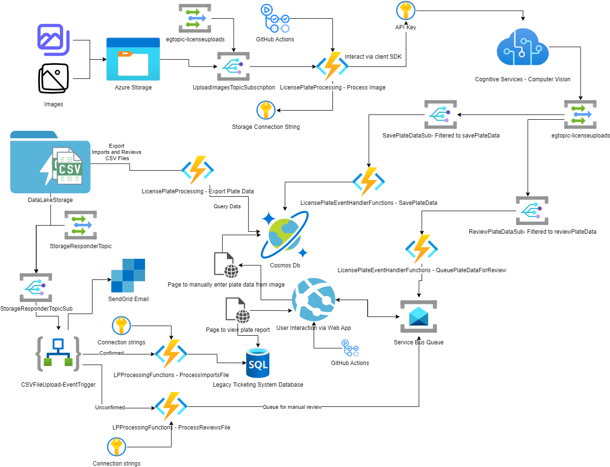

# Serverless Cloud Workshop

This serverless cloud workshop is adapted from the original Microsoft Cloud Workshop that was licensed under MIT and will be retired as of 6/30/2022.  For the legacy offering in the original Microsoft Cloud Workshop format, [review this repository](https://github.com/microsoft/MCW-Serverless-architecture)   

The purpose of this workshop is to continue to provide the excellent training mechanism of a cloud workshop for serverless solutions.

This workshop has been updated and enhanced to utilize .Net 6 and to teach additional concepts for serverless development.  At the time of development, there are no plans to implement a WDS for this workshop, it is all hands-on work within Azure.

In your quest to learn through this workshop, you may choose to take the 'challenge' approach, or you may just complete the walkthrough.  Either way, it is our sincere hope that you will learn through this process and enjoy the activities.

## Additional Notes

As this training module was adapted from an original MCW, a number of the same concepts will be applied.  This training is intended for use to enhance your learning, particularly when studying for the AZ-204 exam or when you just want to become better with serverless technologies at Azure.

As Azure has a number of paths and approaches you can take, it is noted that this workshop only represents one of the possible ways to accomplish tasks with serverless solutions.

## Tech Stack

This workshop requires at least a year of experience with C# (or another OOP tech, but C# is the focus of this workshop).  Additionally, you should be familiar with the concepts of relational and non-relational data, web programming, API interactions, and GitHub Actions.  

In the challenge approach, the instructions will only describe the end goal, and you will need to use the references to complete the requirements.

In the guided walkthrough, the exact steps for completion of each activity will be given to you for your convenience.  Even with the guided walkthrough, you can find divergence and apply skills in the manner you choose.  For example, the guided walkthrough may have imperative commands in a script and you could use ARM or Bicep. Another example will be that a lot of the guides will utilize the portal.  Feel free to enhance your learning by attempting to accomplish the tasks of the workshop using CLI commands or PowerShell/BASH scripts.

## Overview

In this workshop, you have been hired to build a new solution in Azure using various serverless technologies.  The solution has been designed by an architect, and your task is to implement the solution to specifications.

The client would like you to build a solution that allows them to upload images which may or may not contain license plates as taken from various IoT cameras at different speed checkpoints on interstates throughout a few states in the United States.  

You do not need to determine anything about the speed or intent of the vehicle, the cameras and software on the IoT edge will only load photos from vehicles that are deemed in violation of posted speed limits. The photos will be loaded into an Azure storage container with private access only.  Your job will be to pick up the processing from the point of blob creation in storage through identifying and capturing the license plate number.

Of course a number of photos will not be able to be read correctly.  When automated processes cannot determine the license plate number, you will need to send the photo in question to a manual review process. 

The manual review process should not interfere with typical processing of all photos, and should be able to be completely disconnected from the gathering process, while still interacting with the information provided by the gathering system.

At regular intervals, license plate information that is good will be exported to CSV and you will push that data into a database for use in other systems.  Another process will ensure that photos that are not identified will be set for manual review.  

You will use other serverless tools to automate some of the workflows and process various pieces of the solution.

## Technologies

The following technologies will be leveraged in this workshop:  

| **Technology** | **Purpose** |
|---|---|
| [Azure Container Storage](https://docs.microsoft.com/en-us/azure/azure-functions/functions-overview?WT.mc_id=AZ-MVP-5004334) | Store Images |
| [Azure Event Grid](https://docs.microsoft.com/en-us/azure/event-grid/overview?WT.mc_id=AZ-MVP-5004334) | Respond to storage creation events, and utilize custom events to trigger processing |
| [Azure Functions](https://docs.microsoft.com/en-us/azure/azure-functions/functions-overview?WT.mc_id=AZ-MVP-5004334) | Handle Processing images from storage, export plate data, parse CSV files and push to SQL Server, get results and push to CosmosDb |
| [Cosmos Db](https://docs.microsoft.com/en-us/azure/cosmos-db/introduction?WT.mc_id=AZ-MVP-5004334) | Handle the initial screening of images to store good and unknown license plate information |
| [Logic Apps](https://docs.microsoft.com/en-us/azure/logic-apps/logic-apps-overview?WT.mc_id=AZ-MVP-5004334) | Send Emails, Orchestrate the processing of csv files |
| [SQL Server](https://docs.microsoft.com/en-us/azure/azure-sql/azure-sql-iaas-vs-paas-what-is-overview?view=azuresql&WT.mc_id=AZ-MVP-5004334) | Store the finalized data for license plates |
| [Service Bus](https://docs.microsoft.com/en-us/azure/service-bus-messaging/service-bus-messaging-overview?WT.mc_id=AZ-MVP-5004334) | Decouple the serverless workflow from manual user interaction, queue manual plate processing |
| [GitHub Actions](https://docs.microsoft.com/en-us/azure/developer/github/github-actions?WT.mc_id=AZ-MVP-5004334) | Automate the deployment of Function Apps to Azure |
| [Cognitive Services](https://docs.microsoft.com/en-us/azure/cognitive-services/what-are-cognitive-services?WT.mc_id=AZ-MVP-5004334) | Use Optical Character Recognition from Computer Vision for images to try to read license plate data |
| [Computer Vision](https://docs.microsoft.com/en-us/azure/cognitive-services/computer-vision/overview?WT.mc_id=AZ-MVP-5004334) | Use Optical Character Recognition from Computer Vision for images to try to read license plates.  |  
| [Azure DataLake Storage](https://docs.microsoft.com/en-us/azure/storage/blobs/data-lake-storage-introduction?WT.mc_id=AZ-MVP-5004334) | Typically used for BigData Storage, gain a hierarchical approach to data for csv exports |
| [Azure KeyVault](https://docs.microsoft.com/azure/key-vault/general/overview?WT.mc_id=AZ-MVP-5004334) | Utilize KeyVault to store secrets like connection strings, passwords, certificates, and encryption keys |

## Architecture Overview

The architecture for serverless technologies can be overwhelming, so it's critical to have a diagram to remember how everything works together.

The following image shows the intended architecture for the solution:

## Code

Some code will be provided in any path, and sometimes you will need to generate the solutions yourself and write or use the provided code to solve the problems at hand.

## Approach

There are two approaches. 

- Challenge
- WalkThrough

In the Challenge approach, you will be given acceptance criteria and you must meet them to complete the challenges.

In the WalkThrough you will be given step-by-step guidance on one way to implement this solution.  In the walk through, you could provision a number of resources up front, or provision them as you need them.  The walkthrough will build from the ground up in a 'just-in-time' approach. 

It is critical, however, that you group them in a way that allows you to easily manage this solution (typically one resource group and single region provisioning).  

## Prerequisites

To complete this workshop, you should prepare your environment with the following tools:

- Visual Studio Community 2022 or better [Get it here](https://visualstudio.microsoft.com/vs/)  
- Visual Studio Code (optional/instead of VS2022) [Get it Here](https://code.visualstudio.com/)  
- GIT [&& GIT Bash] [Get GIT here](https://git-scm.com/downloads)  
- A GitHub Account where you can create some repositories [get one here](https://github.com/join)  
- An active Azure subscription [get a free Azure Subscription](https://azure.microsoft.com/en-us/free/?WT.mc_id=AZ-MVP-5004334)
- .Net 6 SDK [get it here](https://dotnet.microsoft.com/en-us/download/dotnet/6.0)    
- Experiential and Experimental attitude [if something doesn't work as expected, willing to ensure you've tried everything and taken the chance to learn more while trying to fix the issue]

## Optional Pre-work

To ensure you are set up, you could work through the documentation to create your first function in C# using the tool of your choice.  

- [Create a C# Function using Visual Studio](https://docs.microsoft.com/en-us/azure/azure-functions/functions-create-your-first-function-visual-studio?WT.mc_id=AZ-MVP-5004334)
- [Create a C# Function using VSCode](https://docs.microsoft.com/en-us/azure/azure-functions/create-first-function-vs-code-csharp?WT.mc_id=AZ-MVP-5004334&tabs=in-process)   

## Legal Stuff 

In no way, shape, or form will we be responsible for what you do with this code, nor will we make any guarantees to it's complete accuracy and correct utilization.  Therefore, you agree to use what you learn here and any code at your own risk, and completely exonerate the creators and hosts of this repo from any liabilities or damages you incur from utilization of the concepts and code found in this workshop.

## Final Thoughts  

The main purposes for these training workshops is to help you engage with the technologies at Azure for learning and study purposes, but we also encourage any speakers to leverage this information for conference workshops and/or talks.  Our only ask is that you would let us know if you decide to use this for anything so we can see that it is having a positive impact.
